# 🧠 Lộ Trình Phát Triển AI Engine — HistoryMindAI

> Tài liệu này giải thích **tại sao** hệ thống AI được thiết kế như hiện tại — mỗi quyết định, mỗi lần thay đổi hướng đi, và lý do đằng sau việc chọn từng model.

---

## Mục tiêu

- **Hiểu câu hỏi tiếng Việt** (có dấu, không dấu, viết tắt, lỗi chính tả)
- **Trả lời chính xác**, không lệch chủ đề
- **Miễn phí 100%**, không phụ thuộc API trả phí
- **Deploy được** trên GitHub / Railway (~512MB RAM)

---

## Timeline tổng quan

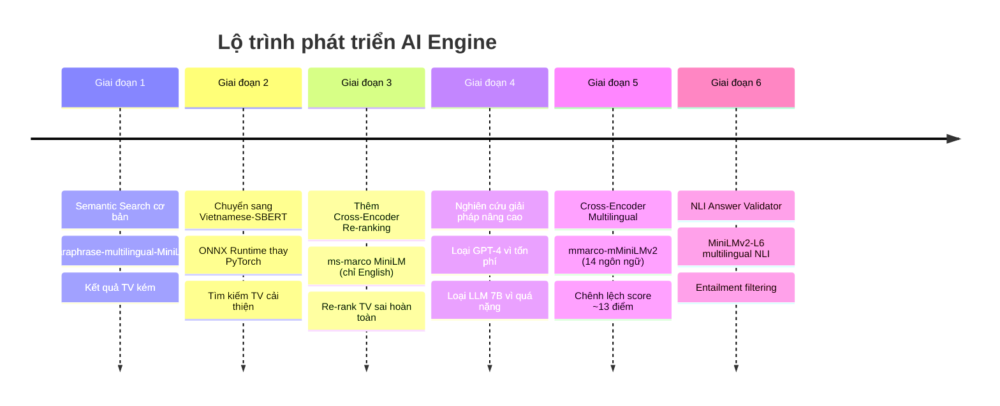

---

## Giai đoạn 1: Semantic Search cơ bản

Dùng **Sentence Transformer** để encode câu hỏi thành vector, tìm kiếm trong FAISS index.

**Model:** `sentence-transformers/paraphrase-multilingual-MiniLM-L12-v2`

**Vấn đề:** Model multilingual chung chung, **không tối ưu cho tiếng Việt**. Với câu hỏi không dấu (ví dụ: `"tran hung dao"`), kết quả rất kém. Không có cơ chế re-ranking → kết quả thô từ FAISS thường lẫn nhiều noise.

> **Bài học:** Multilingual ≠ tốt cho mọi ngôn ngữ. Cần model được **train riêng** cho tiếng Việt.

---

## Giai đoạn 2: Vietnamese-SBERT + ONNX

Thay embedding model bằng **`keepitreal/vietnamese-sbert`** — model Sentence-BERT được train riêng trên dữ liệu tiếng Việt.

### Tại sao chọn model này?

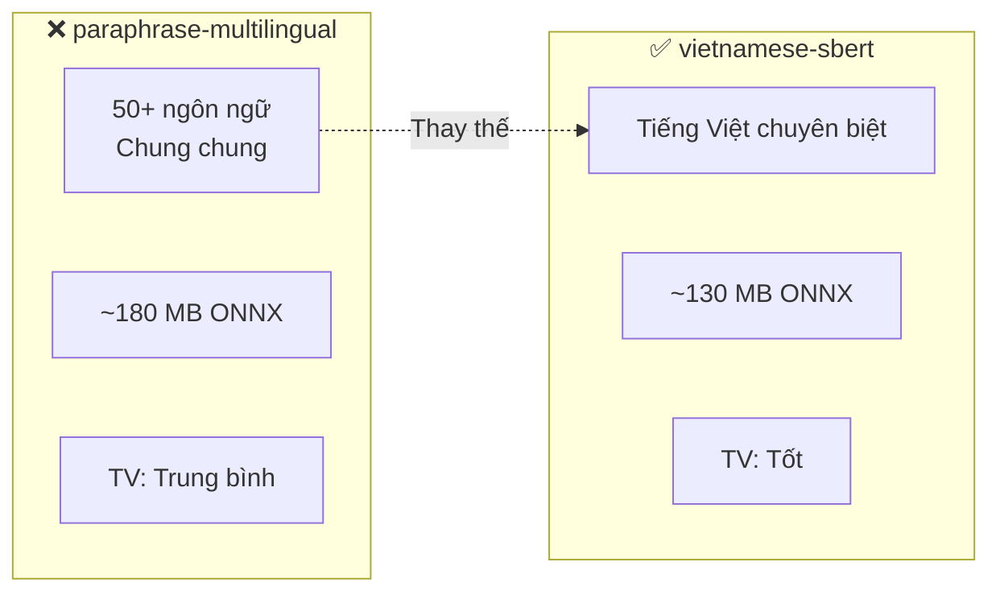

### Tại sao dùng ONNX thay PyTorch?

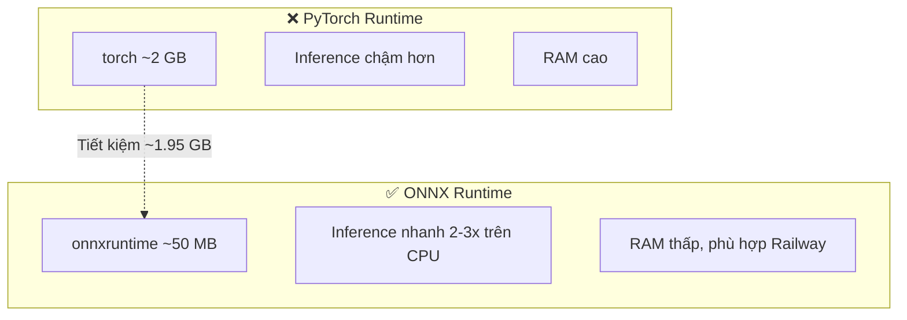

**Kết quả:** Tìm kiếm tiếng Việt cải thiện đáng kể. Nhưng **thứ tự kết quả không tối ưu** → cần re-ranking.

---

## Giai đoạn 3: Thêm Cross-Encoder Re-ranking

### Vấn đề

FAISS trả về top-K dựa trên cosine similarity, nhưng kết quả #5 có thể phù hợp hơn kết quả #1. Bi-encoder nhanh nhưng **không chính xác bằng cross-encoder**.

### Cách hoạt động

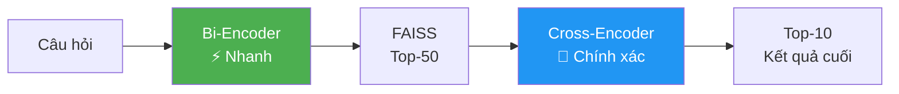

### Model: `ms-marco-MiniLM-L-6-v2` (~87 MB ONNX)

### ❌ Vấn đề nghiêm trọng

Model **chỉ train trên tiếng Anh** (MS MARCO dataset). Khi re-rank câu hỏi tiếng Việt → scoring gần như ngẫu nhiên → câu trả lời lệch xa câu hỏi.

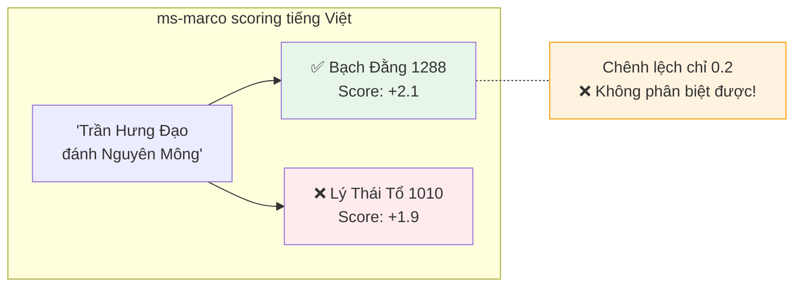

> **Bài học:** Cross-encoder train trên tiếng Anh **KHÔNG THỂ** re-rank tiếng Việt. Đây là bottleneck lớn nhất.

---

## Giai đoạn 4: Nghiên cứu giải pháp nâng cao

### 3 hướng đi được đánh giá

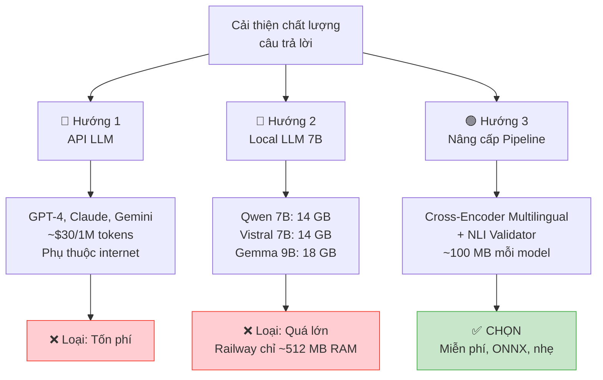

### Chi tiết lý do loại bỏ từng hướng

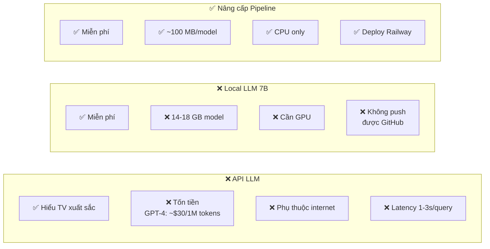

---

## Giai đoạn 5: Cross-Encoder Multilingual ✅

### Model mới: `mmarco-mMiniLMv2-L12-H384-v1`

**Lý do chọn:**
- Train trên **mMARCO** — phiên bản multilingual của MS MARCO
- **14 ngôn ngữ** bao gồm tiếng Việt
- Cùng kiến trúc MiniLM → tương thích ONNX
- Quantized: **~113 MB** (chỉ tăng 26 MB so với cũ)

### Kết quả thực tế

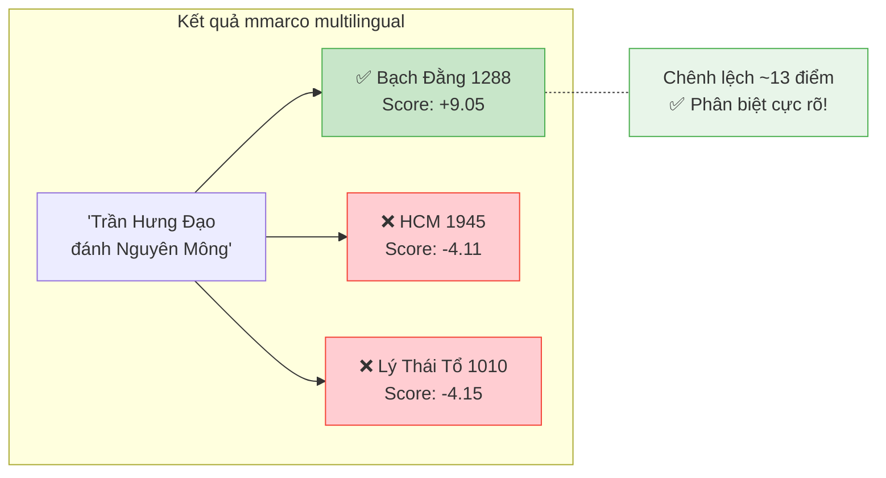

### So sánh trước / sau

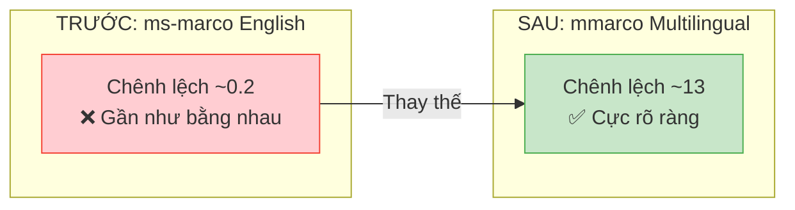

---

## Giai đoạn 6: NLI Answer Validator ✅

### Vấn đề còn lại

Cross-encoder re-rank tốt hơn rồi, nhưng vẫn có trường hợp event "gần đúng" nhưng không thực sự trả lời câu hỏi.

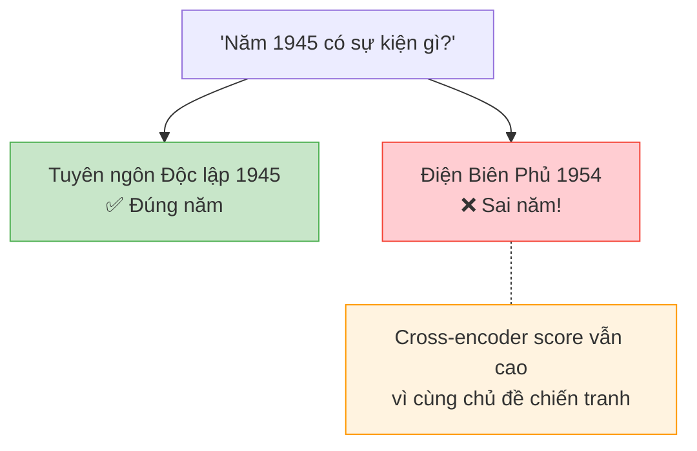

### Giải pháp: Natural Language Inference (NLI)

NLI kiểm tra: **"Event này có HỖ TRỢ (entail) câu hỏi không?"**

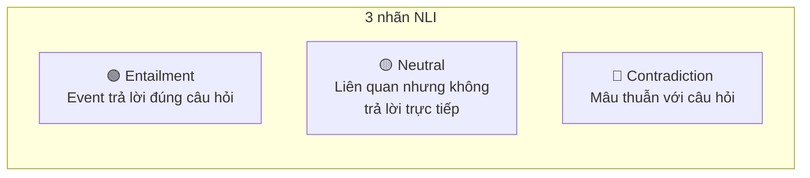

### Tại sao chọn `MiniLMv2-L6-mnli-xnli`?

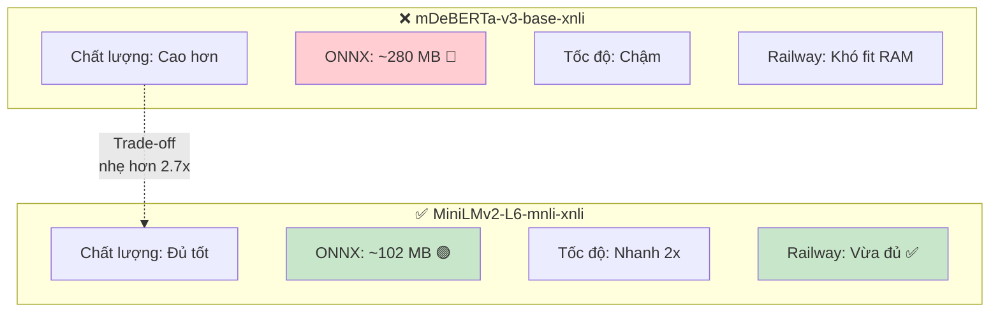

### Kết quả NLI filtering

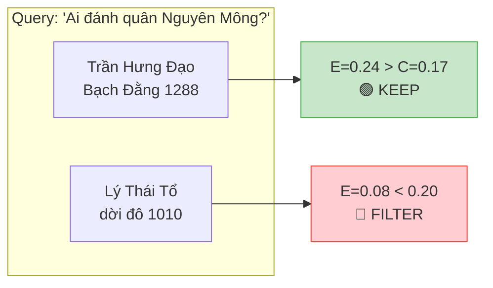

---

## Kiến trúc hiện tại

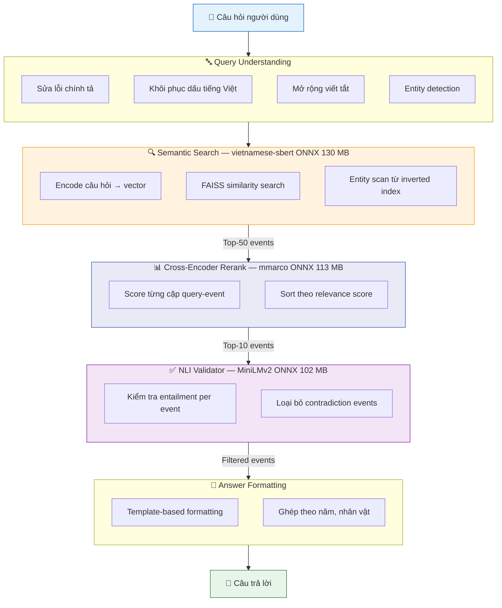

## Tổng kích thước Models

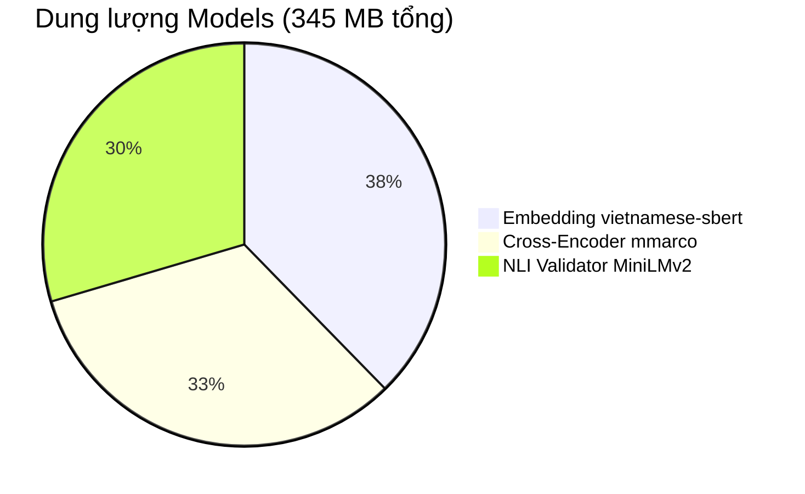

> Tất cả chạy trên **CPU** — không cần GPU. Tổng RAM khi chạy ≈ 400-500 MB.

---

## Tổng hợp các phương án đã cân nhắc

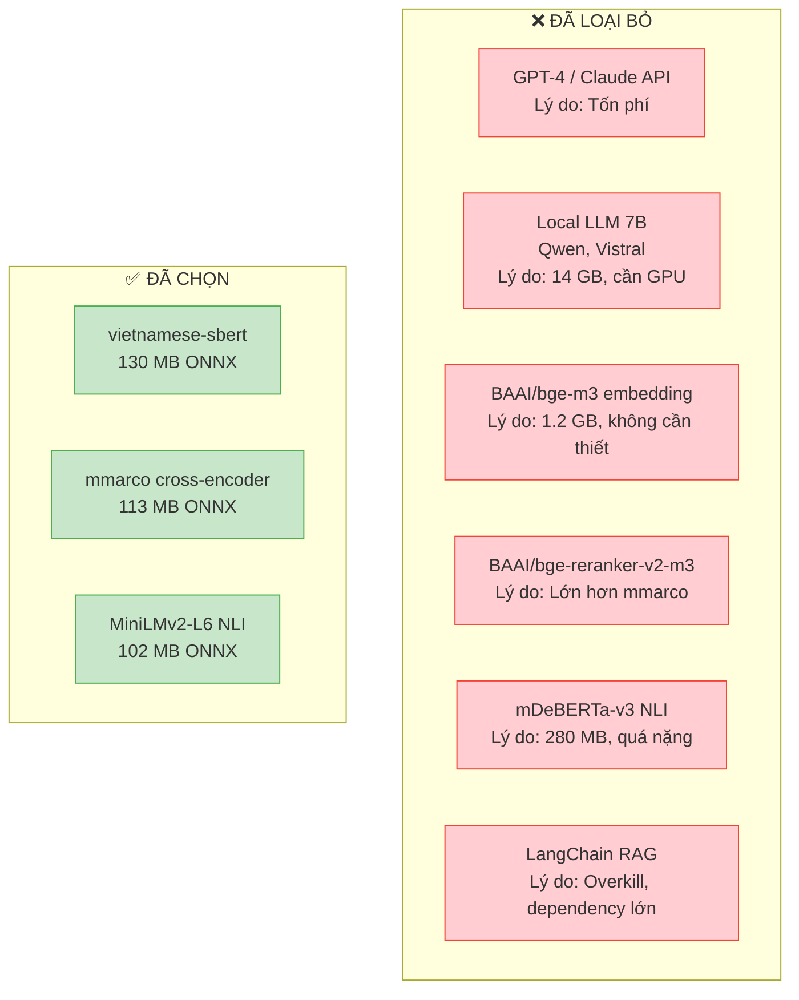

---

## Hướng phát triển tiếp theo

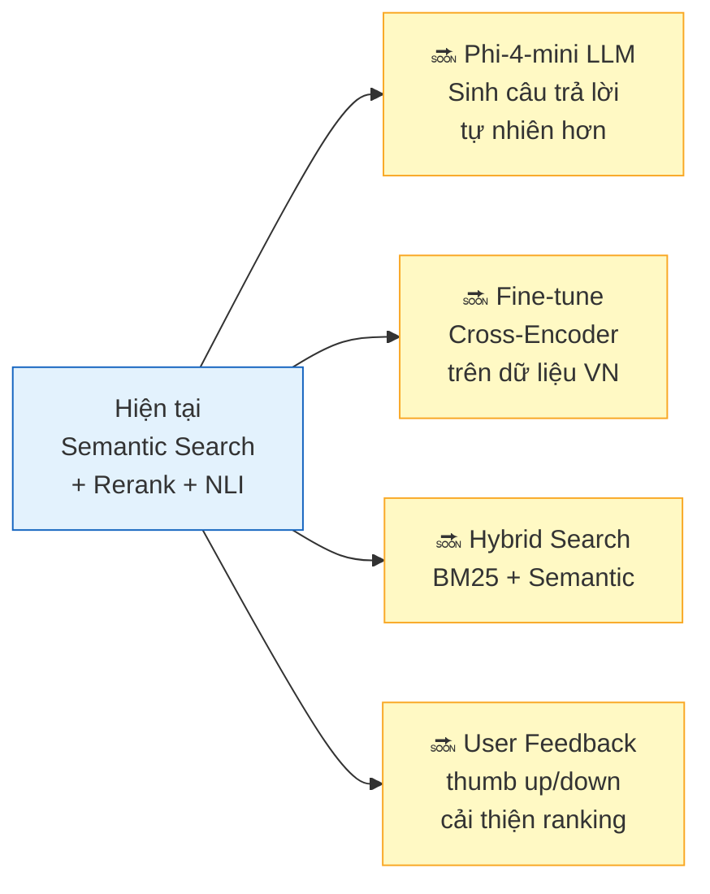

---

*Cập nhật lần cuối: 2026-02-13*
