# 🧠 Lộ Trình Phát Triển AI Engine — HistoryMindAI

> Tài liệu này giải thích **tại sao** hệ thống AI được thiết kế như hiện tại — mỗi quyết định, mỗi lần thay đổi hướng đi, và lý do đằng sau việc chọn từng model.

---

## Mục tiêu

- **Hiểu câu hỏi tiếng Việt** (có dấu, không dấu, viết tắt, lỗi chính tả)
- **Trả lời chính xác**, không lệch chủ đề
- **Miễn phí 100%**, không phụ thuộc API trả phí
- **Deploy được** trên GitHub / Railway (~512MB RAM)

---

## Timeline tổng quan

```mermaid
timeline
    title Lộ trình phát triển AI Engine
    Giai đoạn 1 : Semantic Search cơ bản
                 : paraphrase-multilingual-MiniLM
                 : Kết quả TV kém
    Giai đoạn 2 : Chuyển sang Vietnamese-SBERT
                 : ONNX Runtime thay PyTorch
                 : Tìm kiếm TV cải thiện
    Giai đoạn 3 : Thêm Cross-Encoder Re-ranking
                 : ms-marco MiniLM (chỉ English)
                 : Re-rank TV sai hoàn toàn
    Giai đoạn 4 : Nghiên cứu giải pháp nâng cao
                 : Loại GPT-4 vì tốn phí
                 : Loại LLM 7B vì quá nặng
    Giai đoạn 5 : Cross-Encoder Multilingual
                 : mmarco-mMiniLMv2 (14 ngôn ngữ)
                 : Chênh lệch score ~13 điểm
    Giai đoạn 6 : NLI Answer Validator
                 : MiniLMv2-L6 multilingual NLI
                 : Entailment filtering
    Giai đoạn 7 : Intent Classifier + Answer Synthesis
                 : 10 intent types, duration guard
                 : Template-based answer formatting
    Giai đoạn 8 : Data-Driven Architecture
                 : knowledge_base.json
                 : Dynamic entity registry
                 : Inverted indexes at startup
    Giai đoạn 9 : Robustness + Bug Fixing
                 : 629+ tests, 24 test files
                 : Null safety, type coercion
                 : Edge case handling
```

---

## Giai đoạn 1: Semantic Search cơ bản

Dùng **Sentence Transformer** để encode câu hỏi thành vector, tìm kiếm trong FAISS index.

**Model:** `sentence-transformers/paraphrase-multilingual-MiniLM-L12-v2`

**Vấn đề:** Model multilingual chung chung, **không tối ưu cho tiếng Việt**. Với câu hỏi không dấu (ví dụ: `"tran hung dao"`), kết quả rất kém. Không có cơ chế re-ranking → kết quả thô từ FAISS thường lẫn nhiều noise.

> **Bài học:** Multilingual ≠ tốt cho mọi ngôn ngữ. Cần model được **train riêng** cho tiếng Việt.

---

## Giai đoạn 2: Vietnamese-SBERT + ONNX

Thay embedding model bằng **`keepitreal/vietnamese-sbert`** — model Sentence-BERT được train riêng trên dữ liệu tiếng Việt.

### Tại sao chọn model này?

```mermaid
graph LR
    subgraph "❌ paraphrase-multilingual"
        A1["50+ ngôn ngữ<br/>Chung chung"]
        A2["~180 MB ONNX"]
        A3["TV: Trung bình"]
    end
    subgraph "✅ vietnamese-sbert"
        B1["Tiếng Việt chuyên biệt"]
        B2["~130 MB ONNX"]
        B3["TV: Tốt"]
    end
    A1 -.->|Thay thế| B1
```

### Tại sao dùng ONNX thay PyTorch?

```mermaid
graph TD
    subgraph "❌ PyTorch Runtime"
        P1["torch ~2 GB"]
        P2["Inference chậm hơn"]
        P3["RAM cao"]
    end
    subgraph "✅ ONNX Runtime"
        O1["onnxruntime ~50 MB"]
        O2["Inference nhanh 2-3x trên CPU"]
        O3["RAM thấp, phù hợp Railway"]
    end
    P1 -.->|"Tiết kiệm ~1.95 GB"| O1
```

**Kết quả:** Tìm kiếm tiếng Việt cải thiện đáng kể. Nhưng **thứ tự kết quả không tối ưu** → cần re-ranking.

---

## Giai đoạn 3: Thêm Cross-Encoder Re-ranking

### Vấn đề

FAISS trả về top-K dựa trên cosine similarity, nhưng kết quả #5 có thể phù hợp hơn kết quả #1. Bi-encoder nhanh nhưng **không chính xác bằng cross-encoder**.

### Cách hoạt động

```mermaid
flowchart LR
    Q["Câu hỏi"] --> BiEnc["Bi-Encoder<br/>⚡ Nhanh"]
    BiEnc --> FAISS["FAISS<br/>Top-50"]
    FAISS --> CE["Cross-Encoder<br/>🎯 Chính xác"]
    CE --> Top10["Top-10<br/>Kết quả cuối"]

    style BiEnc fill:#4CAF50,color:#fff
    style CE fill:#2196F3,color:#fff
```

### Model: `ms-marco-MiniLM-L-6-v2` (~87 MB ONNX)

### ❌ Vấn đề nghiêm trọng

Model **chỉ train trên tiếng Anh** (MS MARCO dataset). Khi re-rank câu hỏi tiếng Việt → scoring gần như ngẫu nhiên → câu trả lời lệch xa câu hỏi.

```mermaid
graph LR
    subgraph "ms-marco scoring tiếng Việt"
        Q1["'Trần Hưng Đạo<br/>đánh Nguyên Mông'"]
        E1["✅ Bạch Đằng 1288<br/>Score: +2.1"]
        E2["❌ Lý Thái Tổ 1010<br/>Score: +1.9"]
    end
    Q1 --> E1
    Q1 --> E2
    E1 -.- Note1["Chênh lệch chỉ 0.2<br/>❌ Không phân biệt được!"]

    style E1 fill:#E8F5E9
    style E2 fill:#FFEBEE
    style Note1 fill:#FFF3E0,stroke:#FF9800
```

> **Bài học:** Cross-encoder train trên tiếng Anh **KHÔNG THỂ** re-rank tiếng Việt. Đây là bottleneck lớn nhất.

---

## Giai đoạn 4: Nghiên cứu giải pháp nâng cao

### 3 hướng đi được đánh giá

```mermaid
graph TD
    Root["Cải thiện chất lượng<br/>câu trả lời"] --> H1["🔴 Hướng 1<br/>API LLM"]
    Root --> H2["🔴 Hướng 2<br/>Local LLM 7B"]
    Root --> H3["🟢 Hướng 3<br/>Nâng cấp Pipeline"]

    H1 --> H1R["GPT-4, Claude, Gemini<br/>~$30/1M tokens<br/>Phụ thuộc internet"]
    H1R --> H1X["❌ Loại: Tốn phí"]

    H2 --> H2R["Qwen 7B: 14 GB<br/>Vistral 7B: 14 GB<br/>Gemma 9B: 18 GB"]
    H2R --> H2X["❌ Loại: Quá lớn<br/>Railway chỉ ~512 MB RAM"]

    H3 --> H3R["Cross-Encoder Multilingual<br/>+ NLI Validator<br/>~100 MB mỗi model"]
    H3R --> H3X["✅ CHỌN<br/>Miễn phí, ONNX, nhẹ"]

    style H1X fill:#FFCDD2,stroke:#F44336
    style H2X fill:#FFCDD2,stroke:#F44336
    style H3X fill:#C8E6C9,stroke:#4CAF50
```

### Chi tiết lý do loại bỏ từng hướng

```mermaid
graph LR
    subgraph "❌ API LLM"
        direction TB
        A1["✅ Hiểu TV xuất sắc"]
        A2["❌ Tốn tiền<br/>GPT-4: ~$30/1M tokens"]
        A3["❌ Phụ thuộc internet"]
        A4["❌ Latency 1-3s/query"]
    end

    subgraph "❌ Local LLM 7B"
        direction TB
        B1["✅ Miễn phí"]
        B2["❌ 14-18 GB model"]
        B3["❌ Cần GPU"]
        B4["❌ Không push<br/>được GitHub"]
    end

    subgraph "✅ Nâng cấp Pipeline"
        direction TB
        C1["✅ Miễn phí"]
        C2["✅ ~100 MB/model"]
        C3["✅ CPU only"]
        C4["✅ Deploy Railway"]
    end
```

---

## Giai đoạn 5: Cross-Encoder Multilingual ✅

### Model mới: `mmarco-mMiniLMv2-L12-H384-v1`

**Lý do chọn:**
- Train trên **mMARCO** — phiên bản multilingual của MS MARCO
- **14 ngôn ngữ** bao gồm tiếng Việt
- Cùng kiến trúc MiniLM → tương thích ONNX
- Quantized: **~113 MB** (chỉ tăng 26 MB so với cũ)

### Kết quả thực tế

```mermaid
graph LR
    subgraph "Kết quả mmarco multilingual"
        Q["'Trần Hưng Đạo<br/>đánh Nguyên Mông'"]
        R1["✅ Bạch Đằng 1288<br/>Score: +9.05"]
        R2["❌ HCM 1945<br/>Score: -4.11"]
        R3["❌ Lý Thái Tổ 1010<br/>Score: -4.15"]
    end
    Q --> R1
    Q --> R2
    Q --> R3
    R1 -.- Note["Chênh lệch ~13 điểm<br/>✅ Phân biệt cực rõ!"]

    style R1 fill:#C8E6C9,stroke:#4CAF50
    style R2 fill:#FFCDD2,stroke:#F44336
    style R3 fill:#FFCDD2,stroke:#F44336
    style Note fill:#E8F5E9,stroke:#4CAF50
```

### So sánh trước / sau

```mermaid
graph LR
    subgraph "TRƯỚC: ms-marco English"
        A["Chênh lệch ~0.2<br/>❌ Gần như bằng nhau"]
    end
    subgraph "SAU: mmarco Multilingual"
        B["Chênh lệch ~13<br/>✅ Cực rõ ràng"]
    end
    A -->|"Thay thế"| B

    style A fill:#FFCDD2,stroke:#F44336
    style B fill:#C8E6C9,stroke:#4CAF50
```

---

## Giai đoạn 6: NLI Answer Validator ✅

### Vấn đề còn lại

Cross-encoder re-rank tốt hơn rồi, nhưng vẫn có trường hợp event "gần đúng" nhưng không thực sự trả lời câu hỏi.

```mermaid
graph TD
    Q["'Năm 1945 có sự kiện gì?'"] --> E1["Tuyên ngôn Độc lập 1945<br/>✅ Đúng năm"]
    Q --> E2["Điện Biên Phủ 1954<br/>❌ Sai năm!"]
    E2 -.- Note["Cross-encoder score vẫn cao<br/>vì cùng chủ đề chiến tranh"]

    style E1 fill:#C8E6C9,stroke:#4CAF50
    style E2 fill:#FFCDD2,stroke:#F44336
    style Note fill:#FFF3E0,stroke:#FF9800
```

### Giải pháp: Natural Language Inference (NLI)

NLI kiểm tra: **"Event này có HỖ TRỢ (entail) câu hỏi không?"**

```mermaid
graph LR
    subgraph "3 nhãn NLI"
        E["🟢 Entailment<br/>Event trả lời đúng câu hỏi"]
        N["🟡 Neutral<br/>Liên quan nhưng không<br/>trả lời trực tiếp"]
        C["🔴 Contradiction<br/>Mâu thuẫn với câu hỏi"]
    end
```

### Tại sao chọn `MiniLMv2-L6-mnli-xnli`?

```mermaid
graph TD
    subgraph "❌ mDeBERTa-v3-base-xnli"
        D1["Chất lượng: Cao hơn"]
        D2["ONNX: ~280 MB 🔴"]
        D3["Tốc độ: Chậm"]
        D4["Railway: Khó fit RAM"]
    end
    subgraph "✅ MiniLMv2-L6-mnli-xnli"
        M1["Chất lượng: Đủ tốt"]
        M2["ONNX: ~102 MB 🟢"]
        M3["Tốc độ: Nhanh 2x"]
        M4["Railway: Vừa đủ ✅"]
    end
    D1 -.->|"Trade-off<br/>nhẹ hơn 2.7x"| M1

    style D2 fill:#FFCDD2
    style M2 fill:#C8E6C9
    style M4 fill:#C8E6C9
```

### Kết quả NLI filtering

```mermaid
graph LR
    subgraph "Query: 'Ai đánh quân Nguyên Mông?'"
        E1["Trần Hưng Đạo<br/>Bạch Đằng 1288"]
        E2["Lý Thái Tổ<br/>dời đô 1010"]
    end

    E1 --> R1["E=0.24 > C=0.17<br/>🟢 KEEP"]
    E2 --> R2["E=0.08 < 0.20<br/>🔴 FILTER"]

    style R1 fill:#C8E6C9,stroke:#4CAF50
    style R2 fill:#FFCDD2,stroke:#F44336
```

---

## Giai đoạn 7: Intent Classifier + Answer Synthesis ✅

### Vấn đề

Pipeline NLI + Cross-Encoder tìm đúng kết quả, nhưng **cách trả lời chưa thông minh**:

- Câu hỏi "khi nào" → trả lại danh sách dài thay vì chỉ nêu năm
- Câu hỏi "ai" → dump toàn bộ sự kiện thay vì tập trung nhân vật
- Câu hỏi "liệt kê" → không nhóm theo thời kỳ
- "1000 năm Thăng Long" → hiểu nhầm thành năm 1000

### Giải pháp: Intent Classifier

Phân loại câu hỏi thành **10 intent types** trước khi xử lý:

```mermaid
graph TD
    Q["📝 Câu hỏi"] --> IC["🎯 Intent Classifier"]

    IC --> I1["year_range<br/>'Từ 1945 đến 1975'"]
    IC --> I2["year_specific<br/>'Năm 1945 có gì?'"]
    IC --> I3["person_query<br/>'Trần Hưng Đạo đánh gì?'"]
    IC --> I4["dynasty_query<br/>'Nhà Trần tồn tại bao lâu?'"]
    IC --> I5["event_query<br/>'Trận Bạch Đằng'"]
    IC --> I6["definition<br/>'X là ai?'"]
    IC --> I7["relationship<br/>'A và B là gì của nhau?'"]
    IC --> I8["broad_history<br/>'Lịch sử VN'"]
    IC --> I9["data_scope<br/>'Dataset có gì?'"]
    IC --> I10["semantic<br/>Fallback"]

    style IC fill:#1b4332,color:#fff
    style I1 fill:#E3F2FD
    style I2 fill:#E3F2FD
    style I3 fill:#FFF3E0
    style I4 fill:#FFF3E0
    style I5 fill:#E8F5E9
    style I6 fill:#E8F5E9
    style I7 fill:#F3E5F5
    style I8 fill:#F3E5F5
    style I9 fill:#FCE4EC
    style I10 fill:#ECEFF1
```

### Duration Guard

Phân biệt **"X năm"** là thời gian hay năm lịch sử:

| Input | Phân loại | Giải thích |
|-------|-----------|------------|
| "kỷ niệm 1000 năm Thăng Long" | ⏱️ Duration | 1000 là số năm, không phải năm 1000 |
| "hơn 150 năm chia cắt" | ⏱️ Duration | 150 là thời gian |
| "năm 1945" | 📅 Year | Năm lịch sử cụ thể |
| "sự kiện năm 1010" | 📅 Year | Năm lịch sử cụ thể |

### Answer Synthesis

Điều chỉnh format câu trả lời theo **question_type**:

```mermaid
graph LR
    subgraph "Question Type → Format"
        WHEN["when<br/>'Khi nào?'"] --> WHEN_F["Năm + bối cảnh ngắn"]
        WHO["who<br/>'Ai?'"] --> WHO_F["Tiểu sử + sự kiện chính"]
        WHAT["what<br/>'Gì?'"] --> WHAT_F["Mô tả sự kiện chi tiết"]
        LIST["list<br/>'Liệt kê'"] --> LIST_F["Nhóm theo thời kỳ"]
        SCOPE["scope<br/>'Phạm vi?'"] --> SCOPE_F["Thống kê dataset"]
    end

    style WHEN fill:#E3F2FD
    style WHO fill:#FFF3E0
    style WHAT fill:#E8F5E9
    style LIST fill:#F3E5F5
    style SCOPE fill:#FCE4EC
```

---

## Giai đoạn 8: Data-Driven Architecture ✅

### Vấn đề

Hệ thống trước đó hard-code aliases, synonyms trong code Python → **mỗi lần thêm nhân vật / chủ đề mới phải sửa code, commit, deploy lại**.

### Giải pháp: `knowledge_base.json`

**Single Source of Truth** — tất cả dữ liệu động load từ 1 file JSON:

```mermaid
graph TD
    KB["📄 knowledge_base.json"] --> S1["person_aliases<br/>Trần Quốc Tuấn → Trần Hưng Đạo"]
    KB --> S2["topic_synonyms<br/>Mông Cổ → Nguyên Mông"]
    KB --> S3["dynasty_aliases<br/>Nhà Trần → Trần"]
    KB --> S4["abbreviations<br/>HCM → Hồ Chí Minh"]
    KB --> S5["typo_fixes<br/>quangtrung → quang trung"]
    KB --> S6["question_patterns<br/>ai đã, khi nào, ở đâu"]
    KB --> S7["resistance_synonyms<br/>kháng chiến → [các cuộc chiến]"]

    S1 & S2 & S3 & S4 & S5 & S6 & S7 --> STARTUP["🚀 Startup<br/>Auto-build indexes"]
    STARTUP --> IDX1["📇 PERSON_INDEX"]
    STARTUP --> IDX2["📇 DYNASTY_INDEX"]
    STARTUP --> IDX3["📇 KEYWORD_INDEX"]
    STARTUP --> IDX4["📇 ENTITY_YEAR_INDEX"]

    style KB fill:#FFF3E0,stroke:#FF9800
    style STARTUP fill:#E8F5E9,stroke:#4CAF50
```

### Implicit Context Layer

Xử lý đặc thù 100% dataset là lịch sử Việt Nam:

- **"Việt Nam"** không phải keyword phân biệt → tự động bỏ qua khi filter
- **Kháng chiến** → tự động mở rộng thành các cuộc chiến cụ thể
- **Query rộng** → thêm search queries để bao phủ nhiều triều đại

---

## Giai đoạn 9: Robustness + Bug Fixing ✅

### Vấn đề

Khi scale lên 500K+ documents, xuất hiện các edge cases:

- **Null/empty fields**: Story hoặc event là `None`, empty string
- **Malformed data types**: Year là string, story là integer/list/dict
- **FAISS negative indices**: Index trả về `-1` khi không tìm thấy
- **Empty max() calls**: Không có valid scores để so sánh

### 7 bugs được fix

| Bug | Mô tả | Ảnh hưởng |
|-----|-------|-----------|
| #1 | `clean_story[0].upper()` crash khi string rỗng | Server crash |
| #2 | `max()` trên empty list | Server crash |
| #4 | `None` passed to string operations | Server crash |
| #5 | FAISS negative indices `-1` → array access | Kết quả sai |
| — | `len(non-string)` crash trong sort | Server crash |
| — | Unhashable year types (list, dict) | Server crash |
| — | None years break sort comparison | Server crash |

### Type Safety được thêm vào

```mermaid
graph LR
    subgraph "Trước: Crash với data xấu"
        B1["story = 12345<br/>❌ len(12345)"]
        B2["year = [1945]<br/>❌ unhashable"]
        B3["story = None<br/>❌ None.strip()"]
    end

    subgraph "Sau: Handles gracefully"
        A1["story = 12345<br/>✅ str(12345)"]
        A2["year = [1945]<br/>✅ int(1945)"]
        A3["story = None<br/>✅ return empty"]
    end

    B1 -->|"Type coercion"| A1
    B2 -->|"Year coercion"| A2
    B3 -->|"Null safety"| A3

    style B1 fill:#FFCDD2
    style B2 fill:#FFCDD2
    style B3 fill:#FFCDD2
    style A1 fill:#C8E6C9
    style A2 fill:#C8E6C9
    style A3 fill:#C8E6C9
```

### Test Suite: 629+ tests

| Category | Files | Tests |
|----------|-------|-------|
| Engine | 3 | 78 + 35 + 16 = 129 |
| NLU | 3 | 55 + 30 + 53 = 138 |
| Integration | 2 | 74 + 30 = 104 |
| Pipeline | 3 | 30 + 20 + 30 = 80 |
| API & Schema | 4 | 68 |
| Performance | 2 | 36 |
| Others | 7 | 74 |
| **Tổng** | **24** | **629+** |

---

## Kiến trúc hiện tại (v4.0)

```mermaid
flowchart TD
    Q["📝 Câu hỏi người dùng"] --> NLU

    subgraph NLU["🔤 Query Understanding"]
        direction TB
        N1["Sửa lỗi chính tả"]
        N2["Khôi phục dấu tiếng Việt"]
        N3["Mở rộng viết tắt"]
        N4["Entity detection"]
    end

    NLU --> IC

    subgraph IC["🎯 Intent Classifier — 10 intent types"]
        direction TB
        IC1["Phân loại câu hỏi"]
        IC2["Duration guard"]
        IC3["Question type detection"]
    end

    IC --> Search

    subgraph Search["🔍 Semantic Search — vietnamese-sbert ONNX 130 MB"]
        direction TB
        S1["Encode câu hỏi → vector"]
        S2["FAISS similarity search"]
        S3["Entity scan từ inverted index"]
    end

    Search -->|"Top-50 events"| Rerank

    subgraph Rerank["📊 Cross-Encoder Rerank — mmarco ONNX 113 MB"]
        direction TB
        R1["Score từng cặp query-event"]
        R2["Sort theo relevance score"]
    end

    Rerank -->|"Top-10 events"| NLI

    subgraph NLI["✅ NLI Validator — MiniLMv2 ONNX 102 MB"]
        direction TB
        V1["Kiểm tra entailment per event"]
        V2["Loại bỏ contradiction events"]
    end

    NLI -->|"Filtered events"| Synth

    subgraph Synth["📄 Answer Synthesis"]
        direction TB
        AS1["Template-based formatting"]
        AS2["Question-type aware verbosity"]
        AS3["Period grouping cho list queries"]
    end

    Synth -->|"Implicit context"| Format

    subgraph Format["🌍 Implicit Context"]
        direction TB
        F1["Vietnam scope detection"]
        F2["Resistance term expansion"]
        F3["Non-discriminating keyword filter"]
    end

    Format --> A["💬 Câu trả lời"]

    style Q fill:#E3F2FD,stroke:#1565C0
    style A fill:#E8F5E9,stroke:#2E7D32
    style IC fill:#1b4332,color:#fff
    style Search fill:#FFF3E0,stroke:#FF9800
    style Rerank fill:#E8EAF6,stroke:#3F51B5
    style NLI fill:#F3E5F5,stroke:#7B1FA2
    style Synth fill:#FFF8E1,stroke:#FF6F00
```

## Tổng kích thước Models

```mermaid
pie title Dung lượng Models (345 MB tổng)
    "Embedding vietnamese-sbert" : 130
    "Cross-Encoder mmarco" : 113
    "NLI Validator MiniLMv2" : 102
```

> Tất cả chạy trên **CPU** — không cần GPU. Tổng RAM khi chạy ≈ 400-500 MB.

---

## Tổng hợp các phương án đã cân nhắc

```mermaid
graph TD
    subgraph "❌ ĐÃ LOẠI BỎ"
        X1["GPT-4 / Claude API<br/>Lý do: Tốn phí"]
        X2["Local LLM 7B<br/>Qwen, Vistral<br/>Lý do: 14 GB, cần GPU"]
        X3["BAAI/bge-m3 embedding<br/>Lý do: 1.2 GB, không cần thiết"]
        X4["BAAI/bge-reranker-v2-m3<br/>Lý do: Lớn hơn mmarco"]
        X5["mDeBERTa-v3 NLI<br/>Lý do: 280 MB, quá nặng"]
        X6["LangChain RAG<br/>Lý do: Overkill, dependency lớn"]
    end

    subgraph "✅ ĐÃ CHỌN"
        C1["vietnamese-sbert<br/>130 MB ONNX"]
        C2["mmarco cross-encoder<br/>113 MB ONNX"]
        C3["MiniLMv2-L6 NLI<br/>102 MB ONNX"]
    end

    style X1 fill:#FFCDD2,stroke:#F44336
    style X2 fill:#FFCDD2,stroke:#F44336
    style X3 fill:#FFCDD2,stroke:#F44336
    style X4 fill:#FFCDD2,stroke:#F44336
    style X5 fill:#FFCDD2,stroke:#F44336
    style X6 fill:#FFCDD2,stroke:#F44336
    style C1 fill:#C8E6C9,stroke:#4CAF50
    style C2 fill:#C8E6C9,stroke:#4CAF50
    style C3 fill:#C8E6C9,stroke:#4CAF50
```

---

## Hướng phát triển tiếp theo

```mermaid
graph LR
    Now["Hiện tại v4.0<br/>Semantic Search<br/>+ Rerank + NLI<br/>+ Intent + Synthesis"] --> F1["🔜 Claude LLM<br/>Sinh câu trả lời<br/>tự nhiên hơn<br/>(fallback to rule-based)"]
    Now --> F2["🔜 Fine-tune<br/>Cross-Encoder<br/>trên dữ liệu VN"]
    Now --> F3["🔜 Hybrid Search<br/>BM25 + Semantic"]
    Now --> F4["🔜 User Feedback<br/>thumb up/down<br/>cải thiện ranking"]

    style Now fill:#E3F2FD,stroke:#1565C0
    style F1 fill:#FFF9C4,stroke:#F9A825
    style F2 fill:#FFF9C4,stroke:#F9A825
    style F3 fill:#FFF9C4,stroke:#F9A825
    style F4 fill:#FFF9C4,stroke:#F9A825
```

---

*Cập nhật lần cuối: 2026-02-15*
