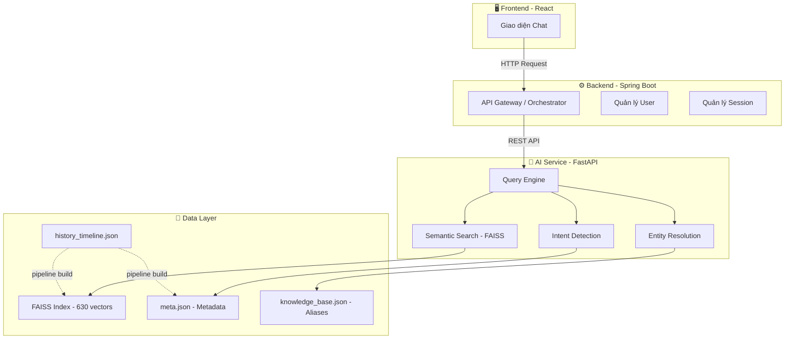
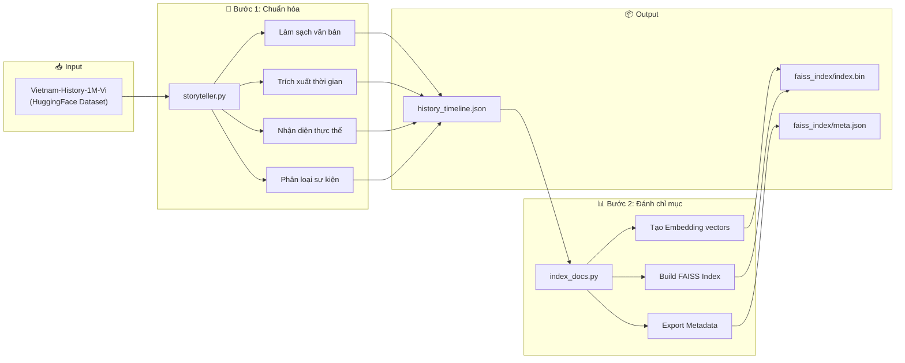
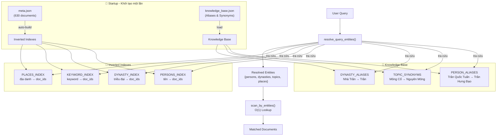
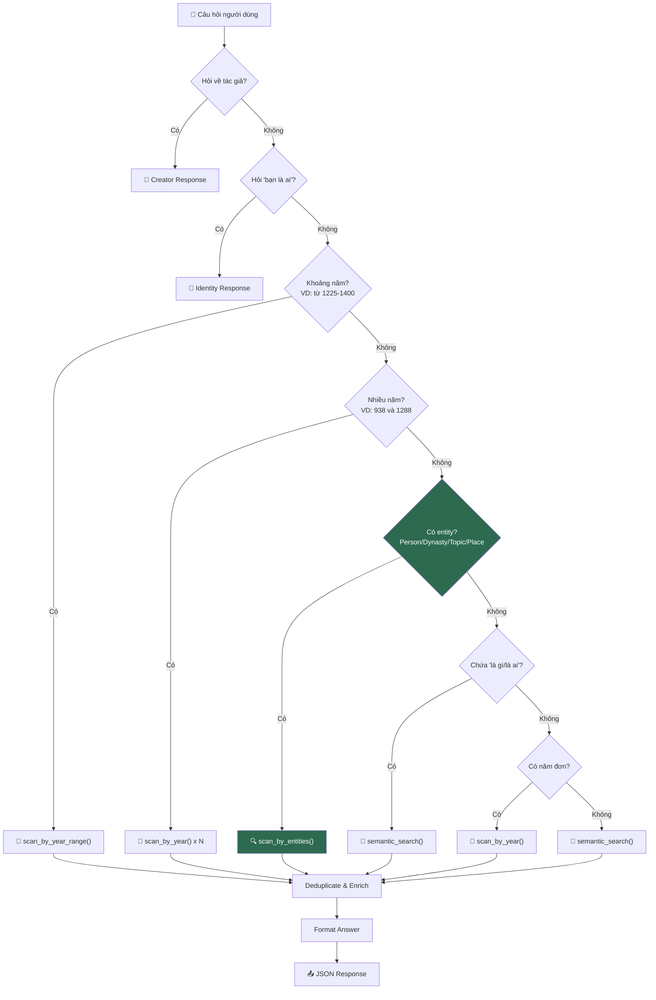
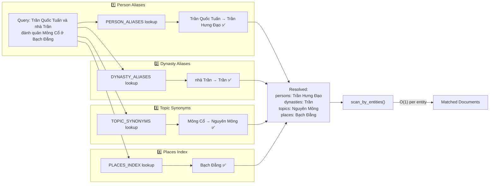
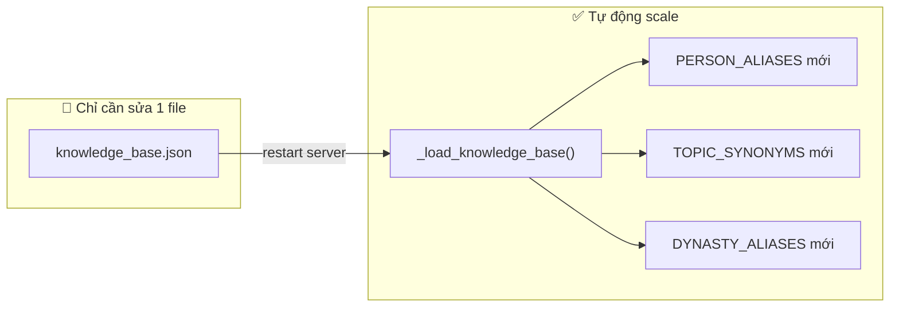

# Vietnam History AI - Hệ thống Chatbot Lịch sử Việt Nam

Dự án này là một hệ thống Chatbot thông minh hỗ trợ tra cứu và trả lời các câu hỏi về lịch sử Việt Nam, sử dụng kỹ thuật RAG (Retrieval-Augmented Generation) để cung cấp thông tin chính xác và có chiều sâu.

## 🏗 Kiến trúc hệ thống

Hệ thống được thiết kế theo mô hình 3 lớp:



1. **Frontend (React)**: Giao diện người dùng cho phép tương tác và trò chuyện với Chatbot.
2. **Backend (Spring Boot)**: Đóng vai trò là lớp điều phối (Orchestrator), xử lý nghiệp vụ chính và quản lý người dùng.
3. **AI Service (FastAPI)**: Cung cấp API xử lý ngôn ngữ tự nhiên, thực hiện tìm kiếm ngữ nghĩa và truy xuất dữ liệu lịch sử.

---

## 🚀 Pipeline xử lý dữ liệu (AI Pipeline)

Quá trình xây dựng cơ sở tri thức cho AI bao gồm các bước:



### 1. Chuẩn hóa và Trích xuất thực thể (`pipeline/storyteller.py`)

- **Dữ liệu đầu vào**: Sử dụng tập dữ liệu [Vietnam-History-1M-Vi](https://huggingface.co/datasets/minhxthanh/Vietnam-History-1M-Vi) (dạng Arrow).
- **Xử lý**:
  - Làm sạch văn bản, loại bỏ các nội dung nhiễu.
  - Trích xuất chính xác thời gian (năm diễn ra sự kiện).
  - Nhận diện các thực thể lịch sử: Nhân vật (Vua, Tướng lĩnh), Địa danh (Chiến trường, Kinh đô), Tập thể (Triều đại, Quân đội).
  - Phân loại tính chất sự kiện (Quân sự, Thể chế, Văn hóa, Kinh tế) và sắc thái (Hào hùng, Bi thương, Trung tính).
- **Kết quả**: Tạo ra file `data/history_timeline.json` chứa dòng thời gian lịch sử đã được cấu trúc hóa.

### 2. Đánh chỉ mục Vector (`pipeline/index_docs.py`)

- **Mô hình Embedding**: Sử dụng `sentence-transformers/paraphrase-multilingual-MiniLM-L12-v2`. Đây là mô hình đa ngôn ngữ mạnh mẽ, hỗ trợ tốt tiếng Việt.
- **Quy trình**:
  - Chuyển đổi các sự kiện lịch sử thành các câu chuyện (stories) có ngữ cảnh.
  - Tạo vector embedding cho từng câu chuyện.
  - Lưu trữ vào **FAISS** (Facebook AI Similarity Search) để thực hiện tìm kiếm vector tốc độ cao.

---

## 🤖 AI Service — Data-Driven Architecture

Dịch vụ API sử dụng kiến trúc **Data-Driven** — không hardcode patterns, tự động scale theo dữ liệu.

### Tổng quan Query Engine



### Chi tiết: Luồng xử lý câu hỏi



### Chi tiết: Entity Resolution (Data-Driven)

Khi user hỏi _"Trần Quốc Tuấn và nhà Trần đánh quân Mông Cổ ở Bạch Đằng"_, hệ thống xử lý:



### Mở rộng hệ thống

> **Muốn thêm nhân vật/alias mới?** Chỉ cần sửa file `knowledge_base.json` — KHÔNG cần sửa code Python.
>
> **Thêm 1000 documents mới?** Inverted indexes tự build tại startup — KHÔNG cần cấu hình gì thêm.



| Thao tác | File cần sửa | Code cần sửa |
|---|---|---|
| Thêm alias nhân vật | `knowledge_base.json` | ❌ Không |
| Thêm synonym chủ đề | `knowledge_base.json` | ❌ Không |
| Thêm alias triều đại | `knowledge_base.json` | ❌ Không |
| Thêm documents mới | `meta.json` (rebuild index) | ❌ Không |

---

## 🧪 Testing

Hệ thống có **282 unit tests** bao phủ toàn diện:

```bash
python -m pytest tests/ -v
```

| File | Nội dung |
|---|---|
| `test_engine.py` | Engine chính: intent routing, entity resolution, year queries, multi-entity, edge cases |
| `test_engine_dedup.py` | Deduplication, text cleaning, keyword extraction |
| `test_search_utils.py` | Search utilities: keyword extraction, relevance filtering, inverted indexes, knowledge base |

---

## 🛠 Hướng dẫn cài đặt và khởi chạy

### Yêu cầu hệ thống

- Python 3.11+
- Các thư viện: `fastapi`, `uvicorn`, `faiss-cpu` (hoặc `faiss-gpu`), `sentence-transformers`, `pydantic`.

### 🚀 Hướng dẫn chạy API (Quan trọng)

Để khởi chạy dịch vụ API cho chatbot, bạn cần thực hiện các bước sau:

1. Di chuyển vào thư mục `ai-service`:
   ```bash
   cd ai-service
   ```
2. Chạy lệnh khởi động server (FastAPI):
   ```bash
   uvicorn app.main:app --reload
   ```
   _(Lưu ý: Đảm bảo bạn đã cài đặt đầy đủ các thư viện Python cần thiết)_

API sẽ mặc định chạy tại: `http://localhost:8000`

### Chạy Pipeline dữ liệu (Khi cần cập nhật dữ liệu)

1.  Chuẩn hóa dữ liệu:
    ```bash
    python pipeline/storyteller.py
    ```
2.  Tạo chỉ mục vector:
    ```bash
    python pipeline/index_docs.py
    ```

---

## 📂 Cấu trúc thư mục

```
vietnam_history_dataset/
├── ai-service/                   # 🤖 FastAPI AI Service
│   ├── app/
│   │   ├── core/
│   │   │   ├── config.py         # Cấu hình paths & constants
│   │   │   └── startup.py        # Build indexes + load knowledge base
│   │   ├── services/
│   │   │   ├── engine.py         # Query Engine — intent routing
│   │   │   └── search_service.py # Entity resolution + FAISS search
│   │   └── main.py               # FastAPI entry point
│   ├── faiss_index/
│   │   ├── index.bin             # FAISS vector index (630 docs)
│   │   └── meta.json             # Document metadata
│   └── knowledge_base.json       # 🔑 Aliases & Synonyms (edit here!)
├── data/
│   └── history_timeline.json     # Structured historical data
├── pipeline/
│   ├── storyteller.py            # Data extraction pipeline
│   └── index_docs.py             # Vector indexing pipeline
└── tests/
    ├── test_engine.py            # Engine core tests
    ├── test_engine_dedup.py      # Dedup & text cleaning tests
    └── test_search_utils.py      # Search & indexing tests
```

## 📚 Công nghệ sử dụng

- **Ngôn ngữ**: Python
- **Framework**: FastAPI
- **Vector Database**: FAISS
- **AI Model**: Sentence-Transformers (MiniLM-L12)
- **Data Processing**: HuggingFace Datasets, Regex, Multiprocessing.

---

_Dự án được phát triển nhằm gìn giữ và truyền bá kiến thức lịch sử Việt Nam thông qua công nghệ AI hiện đại._
