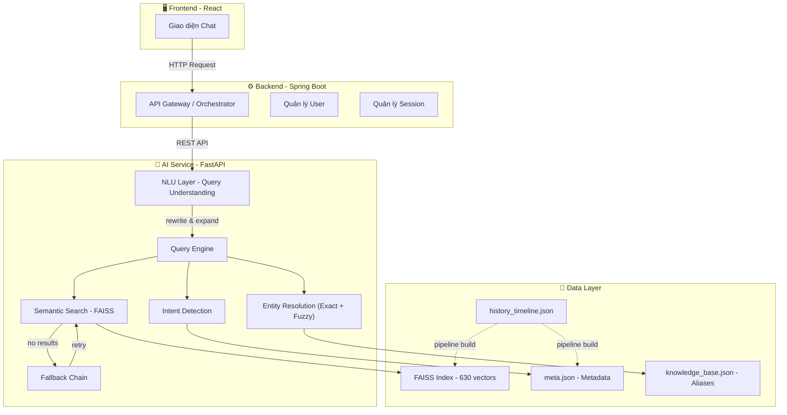
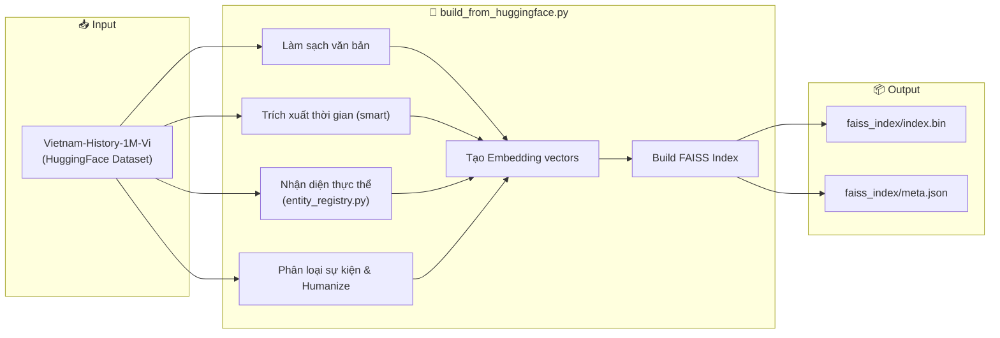
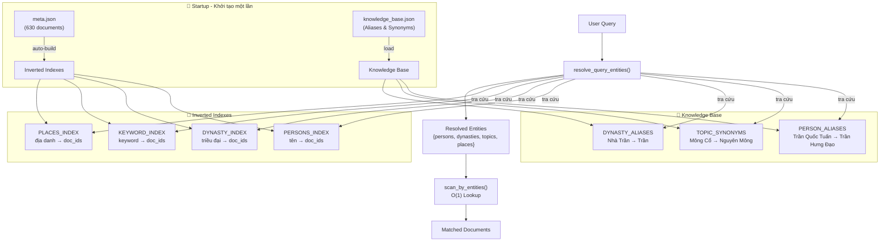
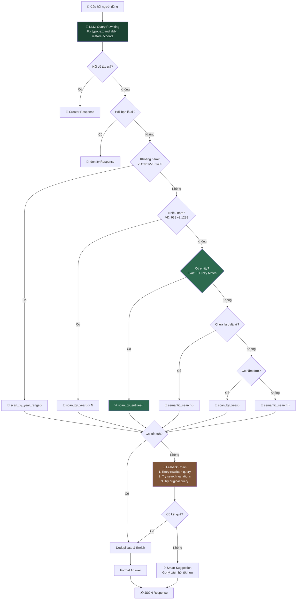
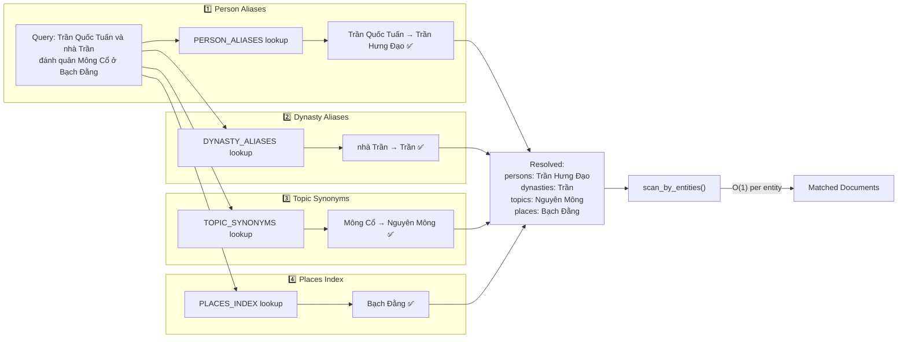
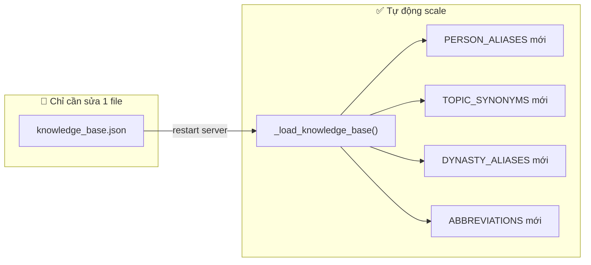

# Vietnam History AI - Hệ thống Chatbot Lịch sử Việt Nam

Dự án này là một hệ thống Chatbot thông minh hỗ trợ tra cứu và trả lời các câu hỏi về lịch sử Việt Nam, sử dụng kỹ thuật RAG (Retrieval-Augmented Generation) để cung cấp thông tin chính xác và có chiều sâu.

## 🏗 Kiến trúc hệ thống

Hệ thống được thiết kế theo mô hình 3 lớp:



1. **Frontend (React)**: Giao diện người dùng cho phép tương tác và trò chuyện với Chatbot.
2. **Backend (Spring Boot)**: Đóng vai trò là lớp điều phối (Orchestrator), xử lý nghiệp vụ chính và quản lý người dùng.
3. **AI Service (FastAPI)**: Cung cấp API xử lý ngôn ngữ tự nhiên, thực hiện tìm kiếm ngữ nghĩa và truy xuất dữ liệu lịch sử.
4. **NLU Layer**: Tầng hiểu ngôn ngữ tự nhiên — tự động sửa lỗi chính tả, mở rộng viết tắt, phục hồi dấu tiếng Việt, fuzzy matching, và chuẩn hóa phát âm.

---

## 🚀 Pipeline xử lý dữ liệu (AI Pipeline)

Quá trình xây dựng cơ sở tri thức cho AI sử dụng script tập trung `build_from_huggingface.py`:



### Script chính: `ai-service/scripts/build_from_huggingface.py`

- **Dữ liệu đầu vào**: Tập dữ liệu [Vietnam-History-1M-Vi](https://huggingface.co/datasets/minhxthanh/Vietnam-History-1M-Vi) (streaming từ HuggingFace).
- **Xử lý**:
  - Làm sạch văn bản, loại bỏ nội dung nhiễu/junk.
  - Trích xuất thời gian thông minh (xử lý edge case: "kỉ niệm 1000 năm").
  - Nhận diện thực thể lịch sử: Nhân vật, Địa danh, Từ khóa (qua `entity_registry.py`).
  - Phân loại tính chất sự kiện (Quân sự, Thể chế, Văn hóa, Kinh tế) và sắc thái.
  - Tự động humanize text thành văn xuôi tiếng Việt tự nhiên.
  - Tạo vector embedding và build FAISS index.
- **Kết quả**: Tạo ra `faiss_index/index.bin` và `faiss_index/meta.json`.

### Mô hình Embedding

- Sử dụng `keepitreal/vietnamese-sbert` — mô hình tiếng Việt chuyên dụng, hỗ trợ tốt tìm kiếm ngữ nghĩa.
- Vector được lưu trữ vào **FAISS** (Facebook AI Similarity Search) để tìm kiếm tốc độ cao.

---

## � NLU — Hiểu Ngôn Ngữ Tự Nhiên

Hệ thống trang bị lớp **NLU (Natural Language Understanding)** giúp chatbot hiểu được nhiều cách diễn đạt khác nhau cho cùng một câu hỏi:

| Tính năng | Ví dụ | Kết quả |
|-----------|-------|--------|
| **Sửa lỗi chính tả** | `nguyen huye` | → `nguyễn huệ` |
| **Mở rộng viết tắt** | `VN độc lập` | → `Việt Nam độc lập` |
| **Phục hồi dấu** | `tran hung dao` | → `trần hưng đạo` |
| **Fuzzy Matching** (always-on) | `trần hưng đao` (sai dấu) | → tìm được `trần hưng đạo` |
| **Phonetic Normalization** | `chần hưng đạo` (lỗi ch/tr) | → `trần hưng đạo` |
| **Multi-query Search** | Ít kết quả → thử alias/synonym | → tìm thêm documents |
| **Synonym Expansion** | `quân mông cổ` | → mở rộng sang `nguyên mông` |
| **Fallback Chain** | Không tìm được → thử lại 3 cách | → gợi ý cách hỏi tốt hơn |

---

## �🤖 AI Service — Data-Driven Architecture

Dịch vụ API sử dụng kiến trúc **Data-Driven** — không hardcode patterns, tự động scale theo dữ liệu.

### Tổng quan Query Engine



### Chi tiết: Luồng xử lý câu hỏi



### Chi tiết: Entity Resolution (Data-Driven)

Khi user hỏi _"Trần Quốc Tuấn và nhà Trần đánh quân Mông Cổ ở Bạch Đằng"_, hệ thống xử lý:



### Mở rộng hệ thống

> **Muốn thêm nhân vật/alias mới?** Chỉ cần sửa file `knowledge_base.json` — KHÔNG cần sửa code Python.
>
> **Thêm 1000 documents mới?** Inverted indexes tự build tại startup — KHÔNG cần cấu hình gì thêm.
>
> **Thêm viết tắt mới?** Sửa `abbreviations` trong `knowledge_base.json` hoặc dict `ABBREVIATIONS` trong `query_understanding.py`.



| Thao tác | File cần sửa | Code cần sửa |
|---|---|---|
| Thêm alias nhân vật | `knowledge_base.json` | ❌ Không |
| Thêm synonym chủ đề | `knowledge_base.json` | ❌ Không |
| Thêm alias triều đại | `knowledge_base.json` | ❌ Không |
| Thêm viết tắt | `knowledge_base.json` | ❌ Không |
| Thêm tên không dấu | `knowledge_base.json` | ❌ Không (auto-gen từ knowledge_base) |
| Thêm documents mới | `meta.json` (rebuild index) | ❌ Không |

---

## 🧪 Testing

Hệ thống có **411 unit tests** bao phủ toàn diện (408 passed, 3 skipped):

```bash
cd ai-service && python -m pytest ../tests/ -v
```

| File | Tests | Nội dung |
|---|---|---|
| `test_engine.py` | 78 | Engine chính: intent routing, entity resolution, year queries, multi-entity, edge cases |
| `test_engine_dedup.py` | 13 | Deduplication, text cleaning, keyword extraction |
| `test_nlu.py` | 55 | **NLU**: query rewriting, fuzzy matching, accent restoration, question intent, phonetic normalization, fallback |
| `test_search_utils.py` | 53 | Search utilities: keyword extraction, relevance filtering, inverted indexes |
| `test_comprehensive.py` | 74 | Comprehensive integration tests |
| `test_pipeline.py` | 30 | Data pipeline: storyteller, text cleaning |
| `test_year_extraction.py` | 30 | Year extraction từ text |
| `test_text_cleaning.py` | 20 | Text normalization và cleaning |
| `test_storyteller_unit.py` | 18 | Storyteller unit tests |
| `test_e2e_api.py` | 10 | End-to-end API tests |
| `test_data_quality.py` | 10 | Data quality validation |
| `test_normalize.py` | 5 | Unicode normalization |
| `test_schema_integrity.py` | 5 | Schema validation |
| `test_api.py` | 5 | API endpoint tests |
| `test_performance.py` | 4 | Performance benchmarks |

---

## 🛠 Hướng dẫn cài đặt và khởi chạy

### Yêu cầu hệ thống

- Python 3.11+
- Các thư viện: `fastapi`, `uvicorn`, `faiss-cpu` (hoặc `faiss-gpu`), `sentence-transformers`, `pydantic`.

### 🚀 Hướng dẫn chạy API (Quan trọng)

Để khởi chạy dịch vụ API cho chatbot, bạn cần thực hiện các bước sau:

1. Di chuyển vào thư mục `ai-service`:
   ```bash
   cd ai-service
   ```
2. Chạy lệnh khởi động server (FastAPI):
   ```bash
   uvicorn app.main:app --reload
   ```
   _(Lưu ý: Đảm bảo bạn đã cài đặt đầy đủ các thư viện Python cần thiết)_

API sẽ mặc định chạy tại: `http://localhost:8000`

### Chạy Pipeline dữ liệu (Khi cần cập nhật dữ liệu)

Script chính tải dữ liệu từ HuggingFace, xử lý, và build FAISS index trong một lần chạy:

```bash
cd ai-service
python scripts/build_from_huggingface.py
```

Có thể tùy chỉnh qua biến môi trường:
```bash
# Số samples tối đa (mặc định: 500,000)
MAX_SAMPLES=100000 python scripts/build_from_huggingface.py
```

---

## 📂 Cấu trúc thư mục

```
vietnam_history_dataset/
├── ai-service/                       # 🤖 FastAPI AI Service
│   ├── app/
│   │   ├── core/
│   │   │   ├── config.py             # Cấu hình paths & constants (incl. NLU)
│   │   │   └── startup.py            # Build indexes + load knowledge base
│   │   ├── services/
│   │   │   ├── engine.py             # Query Engine — intent routing + fallback
│   │   │   ├── query_understanding.py # 🧠 NLU Layer (query rewriting, fuzzy match)
│   │   │   └── search_service.py     # Entity resolution + FAISS search
│   │   └── main.py                   # FastAPI entry point
│   ├── scripts/
│   │   ├── build_from_huggingface.py  # 🚀 Pipeline chính: load + process + build FAISS
│   │   └── entity_registry.py        # Dynamic entity extraction
│   ├── faiss_index/
│   │   ├── index.bin                 # FAISS vector index
│   │   └── meta.json                 # Document metadata
│   └── knowledge_base.json           # 🔑 Aliases, Synonyms & Abbreviations
├── pipeline/                         # (Legacy) pipeline scripts
└── tests/
    ├── test_engine.py                # Engine core tests (78)
    ├── test_engine_dedup.py          # Dedup & text cleaning (13)
    ├── test_nlu.py                   # 🧠 NLU tests (55)
    ├── test_search_utils.py          # Search & indexing (53)
    └── ... (15 test files total)     # 411 tests total
```

## 📚 Công nghệ sử dụng

- **Ngôn ngữ**: Python
- **Framework**: FastAPI
- **Vector Database**: FAISS
- **AI Model**: `keepitreal/vietnamese-sbert` (ONNX) cho embedding tiếng Việt
- **Data Processing**: HuggingFace Datasets, Dynamic Entity Registry, Regex.
- **NLU**: Query rewriting, Fuzzy matching, Accent restoration, Phonetic normalization, Multi-query search (Python stdlib)

---

_Dự án được phát triển nhằm gìn giữ và truyền bá kiến thức lịch sử Việt Nam thông qua công nghệ AI hiện đại._
