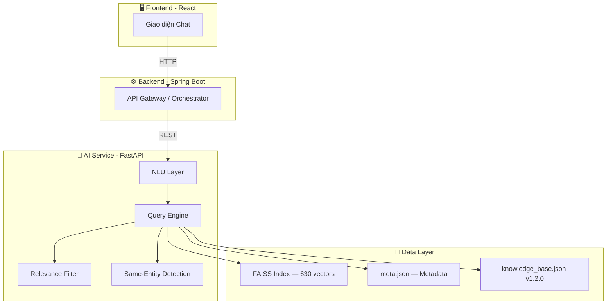
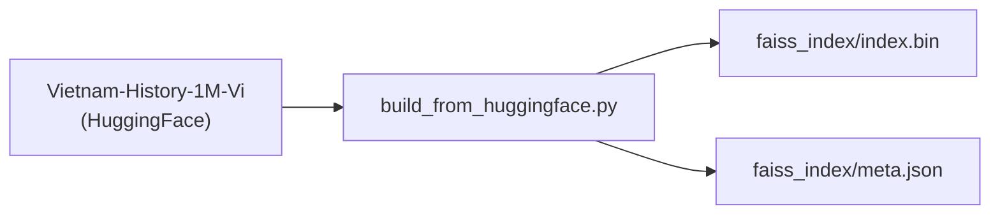
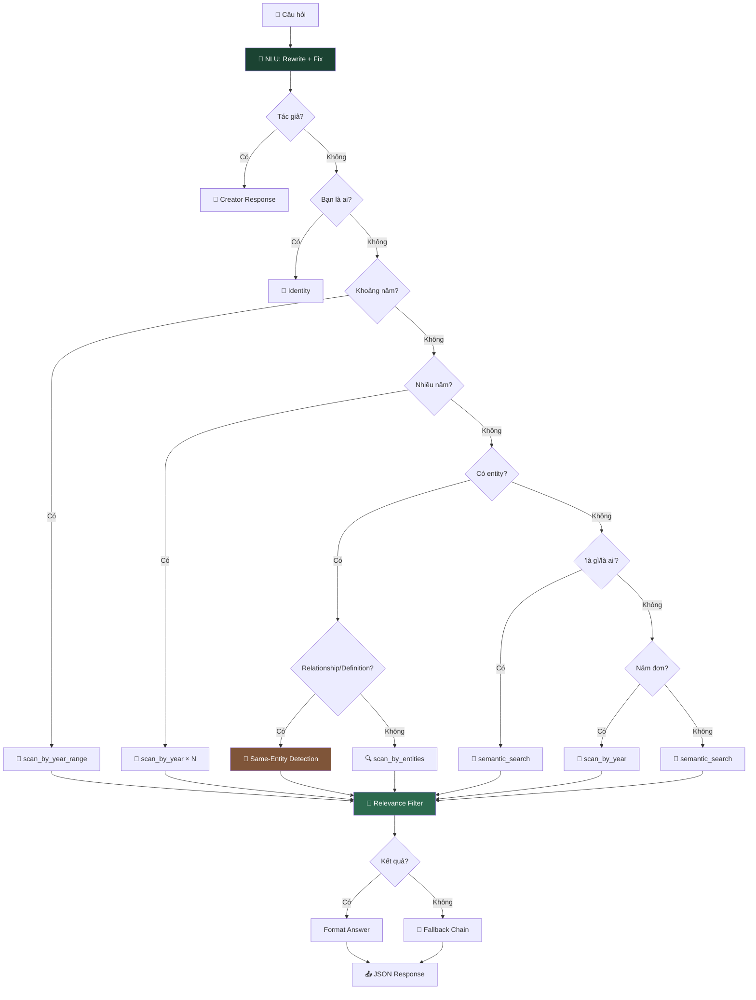

# Vietnam History AI — Hệ thống Chatbot Lịch sử Việt Nam

Dự án này là hệ thống Chatbot thông minh hỗ trợ tra cứu và trả lời các câu hỏi về lịch sử Việt Nam, sử dụng kỹ thuật **RAG (Retrieval-Augmented Generation)** kết hợp **NLU (Natural Language Understanding)**.

## 🏗 Kiến trúc hệ thống



1. **Frontend (React)**: Giao diện chat, render markdown, answer-priority logic.
2. **Backend (Spring Boot)**: Orchestrator — proxy requests, quản lý user/session.
3. **AI Service (FastAPI)**: NLU, entity resolution, semantic search, relevance filtering.

---

## 🚀 Pipeline Xử lý Dữ liệu



### Script chính: `ai-service/scripts/build_from_huggingface.py`

- **Nguồn**: [Vietnam-History-1M-Vi](https://huggingface.co/datasets/minhxthanh/Vietnam-History-1M-Vi) (streaming)
- **Xử lý**: Làm sạch → trích xuất thời gian → nhận diện entity → phân loại → embedding → FAISS
- **Model**: `keepitreal/vietnamese-sbert` (ONNX)

```bash
cd ai-service && python scripts/build_from_huggingface.py
# Tùy chỉnh: MAX_SAMPLES=100000 python scripts/build_from_huggingface.py
```

---

## 🧠 NLU — Hiểu Ngôn Ngữ Tự Nhiên

| Tính năng | Ví dụ | Kết quả |
|-----------|-------|---------|
| **Sửa lỗi chính tả** | `nguyen huye` | → `nguyễn huệ` |
| **Mở rộng viết tắt** | `VN độc lập` | → `Việt Nam độc lập` |
| **Phục hồi dấu** | `tran hung dao` | → `trần hưng đạo` |
| **Fuzzy Matching** | `trần hưng đao` | → `trần hưng đạo` |
| **Phonetic Normalization** | `chần hưng đạo` | → `trần hưng đạo` |
| **Synonym Expansion** | `quân mông cổ` | → `nguyên mông` |
| **Fallback Chain** | Không tìm được → thử 3 cách | → gợi ý alternatives |

---

## 🤖 Query Engine — Luồng xử lý



### Same-Entity Detection (Conditional)

Chỉ kích hoạt khi user hỏi **relationship** (`"là gì của nhau"`) hoặc **definition** (`"là ai"`):

| Query | Intent | Kết quả |
|-------|--------|---------|
| "Quang Trung và Nguyễn Huệ là ai" | `relationship` | ✅ "Cùng một người" + events |
| "Nhà Trần chống Nguyên Mông" | `multi_entity` | ❌ Không trigger same-entity |

Scan 3 alias sources: `PERSON_ALIASES`, `TOPIC_SYNONYMS`, `DYNASTY_ALIASES`.

### Relevance Filter (Relative Scoring)

Loại bỏ events không liên quan bằng **relative word-overlap scoring**:

1. Tách query keywords (≥ 2 chars, loại stopwords)
2. Score mỗi event = số query words xuất hiện trong story/event text
3. Threshold = `max(2, max_score // 2)` — giữ events ≥ 50% điểm cao nhất
4. Fallback cascade: nếu quá strict → giảm threshold

---

## 🔧 Data-Driven Architecture

> **Muốn thêm alias/synonym?** Sửa `knowledge_base.json` — KHÔNG cần sửa code.
> **Thêm documents?** Rebuild FAISS index — inverted indexes tự build tại startup.
> **HISTORICAL_PHRASES** tự động sinh từ entities — không cần khai báo thủ công.

| Thao tác | File cần sửa | Code cần sửa |
|----------|-------------|-------------|
| Thêm alias nhân vật | `knowledge_base.json` | ❌ Không |
| Thêm synonym chủ đề | `knowledge_base.json` | ❌ Không |
| Thêm alias triều đại | `knowledge_base.json` | ❌ Không |
| Thêm viết tắt | `knowledge_base.json` | ❌ Không |
| Thêm sửa lỗi chính tả | `knowledge_base.json` | ❌ Không |
| Thêm documents mới | `meta.json` (rebuild) | ❌ Không |

---

## 🧪 Testing

**408 unit tests** (408 passed, 3 skipped):

```bash
cd ai-service && python -m pytest ../tests/ -v
```

| File | Tests | Nội dung |
|------|-------|---------|
| `test_engine.py` | 78 | Engine: intent, entity, year, multi-entity |
| `test_nlu.py` | 55 | NLU: rewriting, fuzzy, accents, phonetic |
| `test_comprehensive.py` | 74 | Integration tests |
| `test_search_utils.py` | 53 | Search, indexing, relevance |
| `test_pipeline.py` | 30 | Data pipeline |
| `test_year_extraction.py` | 30 | Year extraction |
| `test_text_cleaning.py` | 20 | Text normalization |
| *+ 8 more files* | 68 | API, schema, performance, dedup |

---

## 🛠 Hướng dẫn Cài đặt

### Yêu cầu

- Python 3.11+
- `fastapi`, `uvicorn`, `faiss-cpu`, `sentence-transformers`, `pydantic`

### Chạy API

```bash
cd ai-service
uvicorn app.main:app --reload
# → http://localhost:8000
```

### Chạy bằng Docker

```bash
cd ai-service
docker build -t vietnam-history-ai .
docker run -d -p 8000:8000 --name ai-service-container vietnam-history-ai
```

---

## 📂 Cấu trúc

```
vietnam_history_dataset/
├── ai-service/                        # 🤖 FastAPI AI Service
│   ├── app/
│   │   ├── core/
│   │   │   ├── config.py              # Config paths & constants
│   │   │   └── startup.py             # Build indexes + load knowledge base
│   │   ├── services/
│   │   │   ├── engine.py              # Query Engine + relevance filter
│   │   │   ├── query_understanding.py # 🧠 NLU Layer
│   │   │   └── search_service.py      # Entity resolution + FAISS
│   │   └── main.py                    # FastAPI entry point
│   ├── scripts/
│   │   └── build_from_huggingface.py  # 🚀 Pipeline: HuggingFace → FAISS
│   ├── faiss_index/                   # FAISS index + metadata
│   └── knowledge_base.json            # 🔑 Aliases, Synonyms, Typos, Patterns
├── tests/                             # 408 unit tests (15 files)
└── pipeline/                          # (Legacy)
```

## 📚 Tech Stack

| Thành phần | Công nghệ |
|-----------|-----------|
| Framework | FastAPI + Uvicorn |
| Vector DB | FAISS (Facebook AI) |
| AI Model | `keepitreal/vietnamese-sbert` (ONNX) |
| NLU | Fuzzy matching, accent restoration, phonetic normalization |
| Data | HuggingFace Datasets, Dynamic Entity Registry |

---

_Dự án được phát triển nhằm gìn giữ và truyền bá kiến thức lịch sử Việt Nam thông qua công nghệ AI hiện đại._
