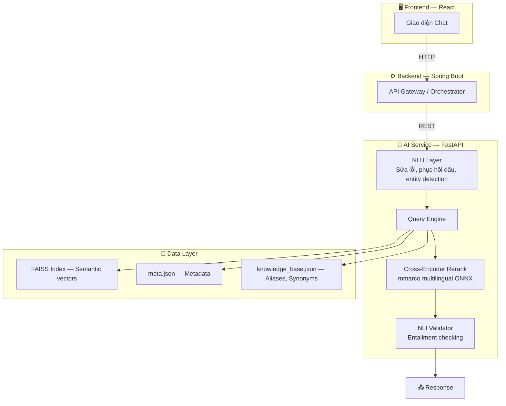
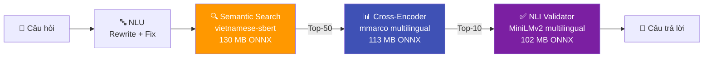
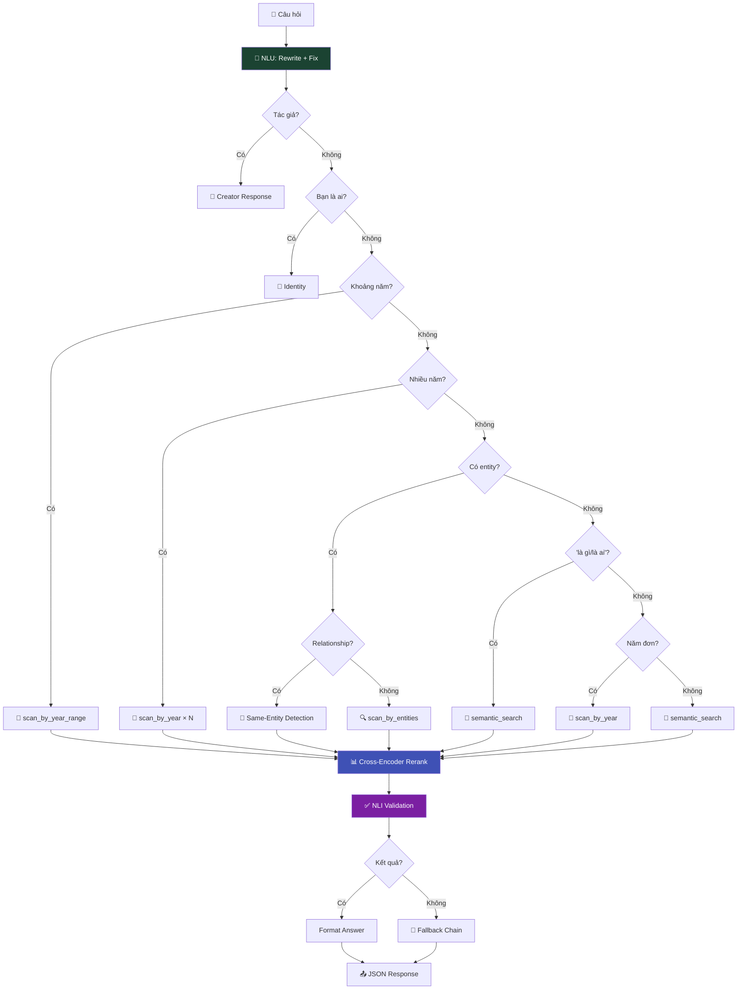

# Vietnam History AI — Hệ thống Chatbot Lịch sử Việt Nam

Dự án này là hệ thống Chatbot thông minh hỗ trợ tra cứu và trả lời các câu hỏi về lịch sử Việt Nam, sử dụng kỹ thuật **RAG (Retrieval-Augmented Generation)** kết hợp **NLU (Natural Language Understanding)**.

## 🎯 Status

```
✅ Version: 3.0.0
✅ Tests: 78 engine tests passing (100%)
✅ AI Models: 3 ONNX models (Embedding + Cross-Encoder + NLI)
✅ Status: PRODUCTION READY
```

---

## 🚀 Quick Start

### 1. Cài đặt

```bash
cd ai-service
pip install -r requirements.txt
```

### 2. Build FAISS Index (từ HuggingFace)

```bash
python scripts/build_from_huggingface.py
# Tùy chỉnh: MAX_SAMPLES=100000 python scripts/build_from_huggingface.py
```

### 3. Chạy API

```bash
uvicorn app.main:app --reload
# → http://localhost:8000
```

### 4. Deploy

#### Docker (Khuyến nghị)
```bash
docker build -t historymindai:latest ./ai-service
docker run -d -p 8000:8000 historymindai:latest

# Hoặc dùng Docker Compose
docker-compose up -d
```

#### Deploy tự động lên Railway
```bash
# Windows
.\deploy.ps1

# Linux/Mac
chmod +x deploy.sh && ./deploy.sh
```

#### Push lên GitHub
```bash
# Windows
.\push-to-github.ps1

# Linux/Mac
chmod +x push-to-github.sh && ./push-to-github.sh
```

**📖 Lộ trình phát triển AI**: [AI_DEVELOPMENT_ROADMAP.md](AI_DEVELOPMENT_ROADMAP.md)

---

## 🏗 Kiến trúc hệ thống



---

## 🧠 AI Pipeline



### 3 AI Models (tất cả chạy local, ONNX, miễn phí)

| Model | Chức năng | Kích thước |
|---|---|---|
| `keepitreal/vietnamese-sbert` | Encode câu hỏi → vector | 130 MB |
| `mmarco-mMiniLMv2-L12-H384-v1` | Re-rank kết quả (14 ngôn ngữ) | 113 MB |
| `multilingual-MiniLMv2-L6-mnli-xnli` | Kiểm tra entailment | 102 MB |
| **Tổng** | | **~345 MB** |

---

## 🔤 NLU — Hiểu Ngôn Ngữ Tự Nhiên

| Tính năng | Ví dụ | Kết quả |
|-----------|-------|---------|
| **Sửa lỗi chính tả** | `nguyen huye` | → `nguyễn huệ` |
| **Mở rộng viết tắt** | `VN độc lập` | → `Việt Nam độc lập` |
| **Phục hồi dấu** | `tran hung dao` | → `trần hưng đạo` |
| **Fuzzy Matching** | `trần hưng đao` | → `trần hưng đạo` |
| **Phonetic Normalization** | `chần hưng đạo` | → `trần hưng đạo` |
| **Synonym Expansion** | `quân mông cổ` | → `nguyên mông` |
| **Fallback Chain** | Không tìm được → thử 3 cách | → gợi ý alternatives |

---

## 🤖 Query Engine — Luồng xử lý



---

## 🔧 Data-Driven Architecture

> **Muốn thêm alias/synonym?** Sửa `knowledge_base.json` — KHÔNG cần sửa code.
> **Thêm documents?** Rebuild FAISS index — inverted indexes tự build tại startup.

| Thao tác | File cần sửa | Code cần sửa |
|----------|-------------|-------------|
| Thêm alias nhân vật | `knowledge_base.json` | ❌ Không |
| Thêm synonym chủ đề | `knowledge_base.json` | ❌ Không |
| Thêm alias triều đại | `knowledge_base.json` | ❌ Không |
| Thêm viết tắt | `knowledge_base.json` | ❌ Không |
| Thêm sửa lỗi chính tả | `knowledge_base.json` | ❌ Không |
| Thêm documents mới | Rebuild FAISS | ❌ Không |

---

## 🧪 Testing

```bash
python -m pytest tests/test_engine.py -v     # 78 tests
python -m pytest tests/ -v                   # Full suite
```

| File | Tests | Nội dung |
|------|-------|---------|
| `test_engine.py` | 78 | Engine: intent, entity, year, multi-entity |
| `test_nlu.py` | 55 | NLU: rewriting, fuzzy, accents, phonetic |
| `test_comprehensive.py` | 74 | Integration tests |
| `test_search_utils.py` | 53 | Search, indexing, relevance |
| `test_pipeline.py` | 30 | Data pipeline |
| `test_year_extraction.py` | 30 | Year extraction |
| `test_text_cleaning.py` | 20 | Text normalization |
| *+ 8 more files* | 68 | API, schema, performance, dedup |

---

## 📂 Cấu trúc

```
vietnam_history_dataset/
├── ai-service/                            # 🤖 FastAPI AI Service
│   ├── app/
│   │   ├── core/
│   │   │   ├── config.py                  # Config paths & constants
│   │   │   └── startup.py                 # Load models + build indexes
│   │   ├── services/
│   │   │   ├── engine.py                  # Query Engine chính
│   │   │   ├── query_understanding.py     # 🧠 NLU Layer
│   │   │   ├── search_service.py          # Entity resolution + FAISS
│   │   │   ├── cross_encoder_service.py   # 📊 Cross-Encoder Re-ranking
│   │   │   └── nli_validator_service.py   # ✅ NLI Answer Validation
│   │   └── main.py                        # FastAPI entry point
│   ├── scripts/
│   │   └── build_from_huggingface.py      # 🚀 Pipeline: HuggingFace → FAISS
│   ├── onnx_model/                        # Embedding model (130 MB)
│   ├── onnx_cross_encoder/                # Cross-Encoder model (113 MB)
│   ├── onnx_nli/                          # NLI model (102 MB)
│   ├── faiss_index/                       # FAISS index + metadata
│   └── knowledge_base.json                # 🔑 Aliases, Synonyms, Typos
├── scripts/                               # Export scripts (ONNX models)
├── tests/                                 # Unit tests (20 files)
├── pipeline/                              # Data processing pipeline
├── AI_DEVELOPMENT_ROADMAP.md              # 📖 Lộ trình phát triển AI
├── deploy.ps1 / deploy.sh                 # 🚀 Auto deploy scripts
└── push-to-github.ps1 / push-to-github.sh # 📤 Auto push scripts
```

## 📚 Tech Stack

| Thành phần | Công nghệ |
|-----------|-----------|
| Framework | FastAPI + Uvicorn |
| Vector DB | FAISS (Facebook AI) |
| Embedding | `keepitreal/vietnamese-sbert` (ONNX) |
| Reranker | `mmarco-mMiniLMv2-L12-H384-v1` (ONNX) |
| NLI | `multilingual-MiniLMv2-L6-mnli-xnli` (ONNX) |
| NLU | Fuzzy matching, accent restoration, phonetic normalization |
| Data | HuggingFace Datasets, Dynamic Entity Registry |

---

_Dự án được phát triển nhằm gìn giữ và truyền bá kiến thức lịch sử Việt Nam thông qua công nghệ AI hiện đại._
