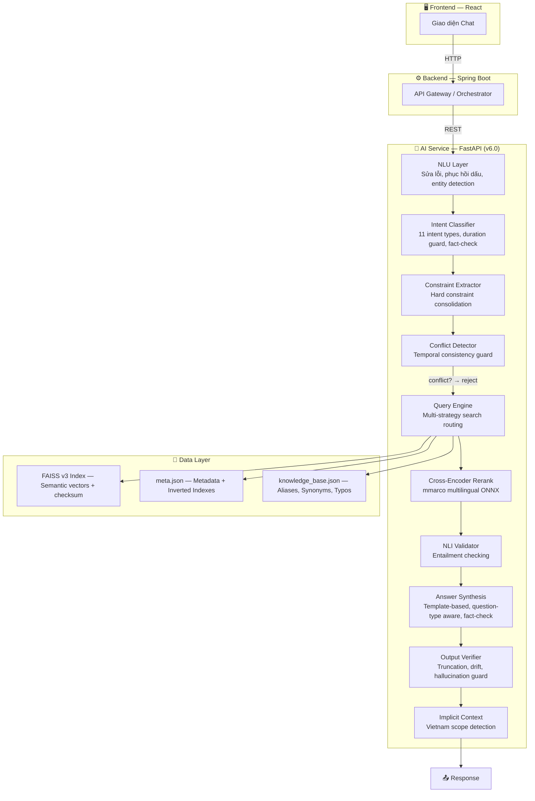
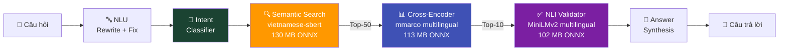
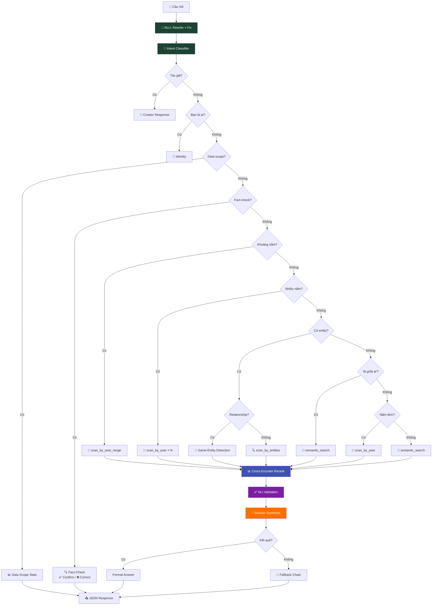

# Vietnam History AI — Hệ thống Chatbot Lịch sử Việt Nam

Dự án này là hệ thống Chatbot thông minh hỗ trợ tra cứu và trả lời các câu hỏi về lịch sử Việt Nam, sử dụng kỹ thuật **RAG (Retrieval-Augmented Generation)** kết hợp **NLU (Natural Language Understanding)** và kiến trúc **Data-Driven** (dữ liệu động từ `knowledge_base.json`).

## 🎯 Status

```
✅ Version: 6.0.0
✅ Tests: 820+ tests passing (26 test files)
✅ AI Models: 3 ONNX models (Embedding + Cross-Encoder + NLI)
✅ Architecture: 14-phase pipeline — NLU → Intent → Constraint → Conflict → Search → Rerank → NLI → Synthesis → Guardrails
✅ Data: HuggingFace Dataset (500K+ samples) → FAISS v3 Index (checksum + atomic writes)
✅ Quality: Enterprise test suite (27 behavioral tests) + Advanced resilience suite (29 tests)
✅ Status: PRODUCTION READY
```

---

## 🚀 Quick Start

### 1. Cài đặt

```bash
cd ai-service
pip install -r requirements.txt
```

### 2. Build FAISS Index (từ HuggingFace)

```bash
cd ai-service
python scripts/build_from_huggingface.py
# Tùy chỉnh: MAX_SAMPLES=100000 python scripts/build_from_huggingface.py
```

### 3. Chạy API

```bash
cd ai-service
uvicorn app.main:app --reload
# → http://localhost:8000
# → Swagger UI: http://localhost:8000/docs
```

### 4. Deploy

#### Docker (Khuyến nghị)
```bash
docker build -t historymindai:latest ./ai-service
docker run -d -p 8000:8000 historymindai:latest

# Hoặc dùng Docker Compose
docker-compose up -d
```

#### Deploy tự động lên Railway
```bash
# Windows
.\deploy.ps1

# Linux/Mac
chmod +x deploy.sh && ./deploy.sh
```

#### Push lên GitHub
```bash
# Windows
.\push-to-github.ps1

# Linux/Mac
chmod +x push-to-github.sh && ./push-to-github.sh
```

**📖 Lộ trình phát triển AI**: [AI_DEVELOPMENT_ROADMAP.md](AI_DEVELOPMENT_ROADMAP.md)

---

## 🏗 Kiến trúc hệ thống



---

## 🧠 AI Pipeline



### 3 AI Models (tất cả chạy local, ONNX, miễn phí)

| Model | Chức năng | Kích thước |
|---|---|---|
| `keepitreal/vietnamese-sbert` | Encode câu hỏi → vector | 130 MB |
| `mmarco-mMiniLMv2-L12-H384-v1` | Re-rank kết quả (14 ngôn ngữ) | 113 MB |
| `multilingual-MiniLMv2-L6-mnli-xnli` | Kiểm tra entailment | 102 MB |
| **Tổng** | | **~345 MB** |

---

## 🔤 NLU — Hiểu Ngôn Ngữ Tự Nhiên

| Tính năng | Ví dụ | Kết quả |
|-----------|-------|---------  |
| **Sửa lỗi chính tả** | `nguyen huye` | → `nguyễn huệ` |
| **Mở rộng viết tắt** | `VN độc lập` | → `Việt Nam độc lập` |
| **Phục hồi dấu** | `tran hung dao` | → `trần hưng đạo` |
| **Fuzzy Matching** | `trần hưng đao` | → `trần hưng đạo` |
| **Phonetic Normalization** | `chần hưng đạo` | → `trần hưng đạo` |
| **Synonym Expansion** | `quân mông cổ` | → `nguyên mông` |
| **Fallback Chain** | Không tìm được → thử 3 cách | → gợi ý alternatives |

---

## 🎯 Intent Classifier — Phân loại câu hỏi

| Intent | Mô tả | Ví dụ |
|--------|-------|-------|
| `year_range` | Truy vấn khoảng năm | "Từ 1945 đến 1975 có sự kiện gì?" |
| `year_specific` | Năm cụ thể | "Năm 1945 có sự kiện gì?" |
| `person_query` | Nhân vật lịch sử | "Trần Hưng Đạo đánh quân gì?" |
| `dynasty_query` | Triều đại | "Nhà Trần tồn tại bao lâu?" |
| `event_query` | Sự kiện / chủ đề | "Trận Bạch Đằng 938 diễn ra thế nào?" |
| `definition` | Định nghĩa | "Trần Quốc Tuấn là ai?" |
| `relationship` | Mối quan hệ | "Trần Hưng Đạo và Trần Quốc Tuấn là gì?" |
| `broad_history` | Lịch sử tổng quan | "Lịch sử Việt Nam qua các triều đại" |
| `fact_check` | Kiểm tra sự thật | "Bác Hồ ra đi năm 1991 phải không?" |
| `data_scope` | Phạm vi dữ liệu | "Bạn có dữ liệu đến năm nào?" |
| `semantic` | Fallback tìm kiếm ngữ nghĩa | Query chung |

> **Duration Guard**: Tự động phát hiện "1000 năm Thăng Long" = kỷ niệm, KHÔNG phải năm 1000. Xử lý thông minh "hơn 150 năm chia cắt", "kỷ niệm 1000 năm".
>
> **Fact-Check**: Phát hiện khi người dùng nêu một sự thật sai và hỏi xác nhận ("...năm 1991 phải không?") → so sánh với dữ liệu thực → ✅ xác nhận hoặc ❌ sửa lịch sự.

---

## 🤖 Query Engine — Luồng xử lý



---

## 🔧 Data-Driven Architecture

> **Muốn thêm alias/synonym?** Sửa `knowledge_base.json` — KHÔNG cần sửa code.
> **Thêm documents?** Rebuild FAISS index — inverted indexes tự build tại startup.

| Thao tác | File cần sửa | Code cần sửa |
|----------|-------------|-------------|
| Thêm alias nhân vật | `knowledge_base.json` | ❌ Không |
| Thêm synonym chủ đề | `knowledge_base.json` | ❌ Không |
| Thêm alias triều đại | `knowledge_base.json` | ❌ Không |
| Thêm viết tắt | `knowledge_base.json` | ❌ Không |
| Thêm sửa lỗi chính tả | `knowledge_base.json` | ❌ Không |
| Thêm documents mới | Rebuild FAISS | ❌ Không |

### Knowledge Base (`knowledge_base.json` v1.2.0)

| Section | Mô tả | Ví dụ |
|---|---|---|
| `person_aliases` | Biệt danh nhân vật lịch sử | Trần Quốc Tuấn → Trần Hưng Đạo |
| `topic_synonyms` | Từ đồng nghĩa chủ đề | Mông Cổ → Nguyên Mông |
| `dynasty_aliases` | Alias triều đại | Nhà Trần → Trần |
| `abbreviations` | Viết tắt | HCM → Hồ Chí Minh |
| `typo_fixes` | Sửa lỗi chính tả | quangtrung → quang trung |
| `question_patterns` | Mẫu câu hỏi tìm kiếm | ai đã, khi nào, ở đâu |
| `resistance_synonyms` | Mở rộng kháng chiến | kháng chiến → các cuộc chiến cụ thể |

> **Lưu ý**: `HISTORICAL_PHRASES` (cụm từ lịch sử đa từ) và inverted indexes (PERSON, DYNASTY, KEYWORD) được **tự động sinh** tại startup từ dữ liệu — không cần khai báo thủ công.

---

## 🧪 Testing

```bash
# Chạy tất cả tests
python -m pytest tests/ -v                              # Full suite (820+ tests)
python -m pytest tests/test_enterprise_levels.py -v      # Enterprise behavioral suite
python -m pytest tests/test_advanced_resilience.py -v     # Advanced resilience suite
python -m pytest tests/test_engine.py -v                 # Engine core tests
```

### Test Suites

| Suite | File | Tests | Focus |
|-------|------|-------|-------|
| **Enterprise Levels** | `test_enterprise_levels.py` | 27 | 6-level behavioral validation (sanity → adversarial) |
| **Advanced Resilience** | `test_advanced_resilience.py` | 29 | Determinism, retrieval integrity, guardrails, chaos, concurrency, performance |
| Engine Core | `test_engine.py` | 130 | Intent, entity, year, fact-check, multi-entity |
| Conflict Detector | `test_conflict_detector.py` | 90+ | Temporal contradiction, constraint extraction |
| Comprehensive | `test_comprehensive.py` | 74 | Integration: accuracy, relevance |
| NLU | `test_nlu.py` | 55 | Rewriting, fuzzy, accents, phonetic |
| Search | `test_search_utils.py` | 53 | Search, indexing, relevance |
| Edge Cases | `test_edge_cases.py` | 35 | Malformed data, boundary |
| Intent Classifier | `test_intent_classifier.py` | 30+ | Intent detection, duration guard |
| Year Extraction | `test_year_extraction.py` | 30 | Year extraction |
| Pipeline | `test_pipeline.py` | 30 | Data pipeline |
| *+ 15 more files* | | 240+ | API, schema, performance, dedup, fuzzy, etc. |
| **Tổng** | **26 files** | **820+** | |

---

## 📂 Cấu trúc

```
vietnam_history_dataset/
├── ai-service/                            # 🤖 FastAPI AI Service
│   ├── app/
│   │   ├── core/
│   │   │   ├── config.py                  # Config paths & constants
│   │   │   ├── query_schema.py            # QueryInfo dataclass
│   │   │   └── startup.py                 # Load models + build indexes
│   │   ├── services/
│   │   │   ├── engine.py                  # 🧠 Query Engine chính (~1500 LOC)
│   │   │   ├── query_understanding.py     # 🔤 NLU Layer
│   │   │   ├── search_service.py          # 🔍 Entity resolution + FAISS
│   │   │   ├── cross_encoder_service.py   # 📊 Cross-Encoder Re-ranking
│   │   │   ├── nli_validator_service.py   # ✅ NLI Answer Validation
│   │   │   ├── intent_classifier.py       # 🎯 Intent Classification (11 types)
│   │   │   ├── constraint_extractor.py    # 📐 Constraint Extraction (Phase 11)
│   │   │   ├── conflict_detector.py       # ⚠️ Temporal Conflict Detection
│   │   │   ├── answer_synthesis.py        # 📄 Answer Synthesis + Fact-Check
│   │   │   ├── answer_validator.py        # ✔️ Answer Validation
│   │   │   ├── guardrails.py              # 🛡️ Output Verifier (Phase 5)
│   │   │   ├── confidence_scorer.py       # 📊 Confidence Scoring
│   │   │   ├── rewrite_engine.py          # ✏️ Query Rewriting
│   │   │   ├── implicit_context.py        # 🌍 Implicit Vietnam Context
│   │   │   ├── semantic_intent.py         # 🎭 Semantic Intent (war/territorial)
│   │   │   ├── semantic_layer.py          # 🔗 Semantic Layer
│   │   │   └── context7_service.py        # Context7 integration
│   │   └── main.py                        # FastAPI entry point
│   ├── scripts/
│   │   └── build_from_huggingface.py      # 🚀 Pipeline: HuggingFace → FAISS v3
│   ├── onnx_model/                        # Embedding model (130 MB)
│   ├── onnx_cross_encoder/                # Cross-Encoder model (113 MB)
│   ├── onnx_nli/                          # NLI model (102 MB)
│   ├── faiss_index/                       # FAISS v3 index + meta.json + checksum
│   ├── knowledge_base.json                # 🔑 Aliases, Synonyms, Typos
│   └── Dockerfile                         # Docker build config
├── pipeline/                              # Data processing pipeline
│   ├── storyteller.py                     # HuggingFace → structured data
│   ├── clean_structured_data.py           # Data cleaning
│   └── index_docs.py                      # FAISS index builder
├── tests/                                 # 🧪 Test suites (26 files, 820+ tests)
│   ├── test_enterprise_levels.py          # Enterprise behavioral validation (27 tests)
│   ├── test_advanced_resilience.py        # Advanced resilience (29 tests)
│   └── ...                                # + 24 more test files
├── deploy.ps1 / deploy.sh                 # 🚀 Auto deploy scripts
├── push-to-github.ps1 / push-to-github.sh # 📤 Auto push scripts
├── docker-compose.yml                     # Docker Compose config
└── AI_DEVELOPMENT_ROADMAP.md              # 📖 Lộ trình phát triển AI
```

## 📚 Tech Stack

| Thành phần | Công nghệ |
|-----------|-----------|
| Framework | FastAPI + Uvicorn |
| Vector DB | FAISS (Facebook AI) |
| Embedding | `keepitreal/vietnamese-sbert` (ONNX) |
| Reranker | `mmarco-mMiniLMv2-L12-H384-v1` (ONNX) |
| NLI | `multilingual-MiniLMv2-L6-mnli-xnli` (ONNX) |
| NLU | Fuzzy matching, accent restoration, phonetic normalization |
| Intent | Custom rule-based classifier (11 intent types + fact-check) |
| Synthesis | Template-based, question-type aware |
| Data | HuggingFace Datasets, Dynamic Entity Registry |
| Deploy | Docker, Railway, GitHub Actions |

---

_Dự án được phát triển nhằm gìn giữ và truyền bá kiến thức lịch sử Việt Nam thông qua công nghệ AI hiện đại._
